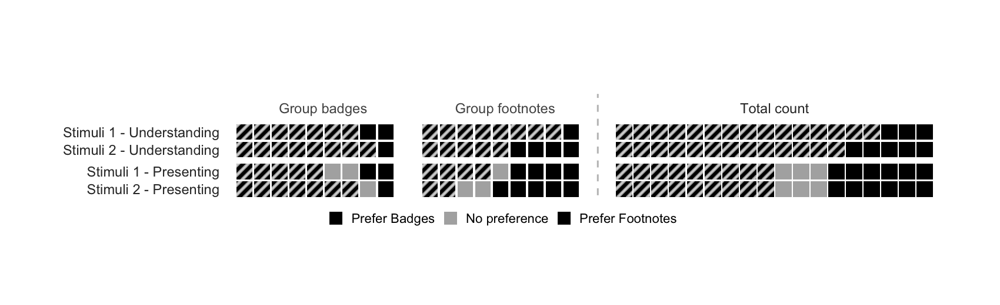
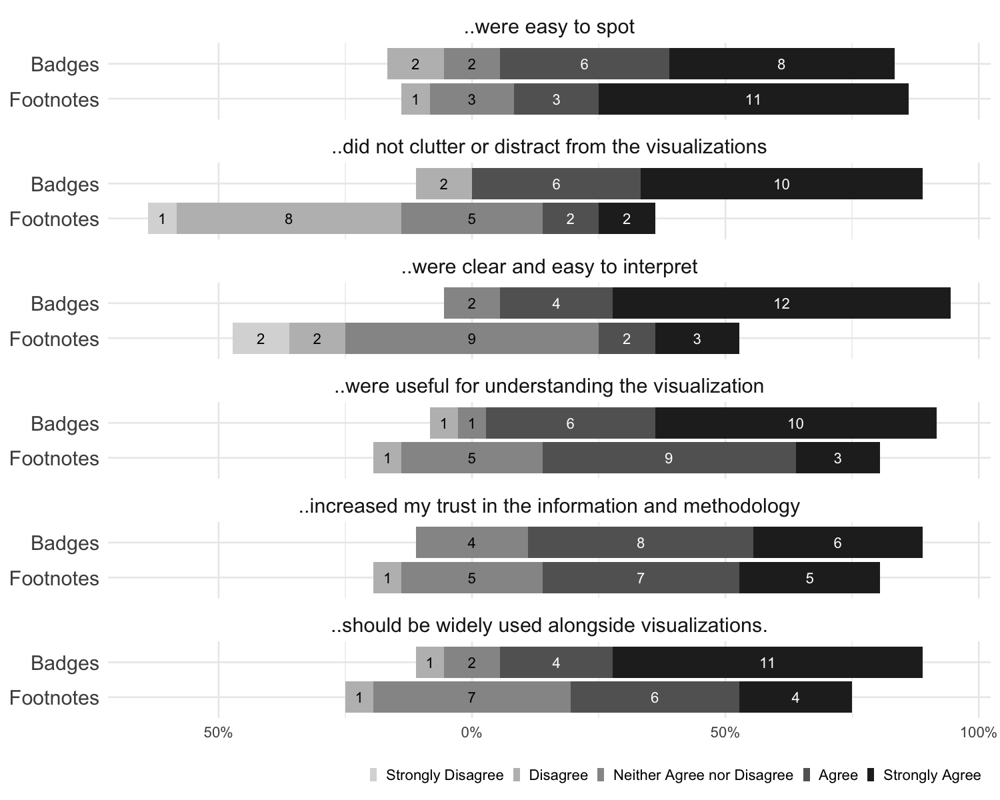

# Mind the Badge - Study Data Report
Generated at: `Mon, 29 Dec 2025 15:16 CET`

## Study metadata

**Demographics**

| Category | |
|---|---|
| Gender | Man (14), Woman (10) |
| Age | 35-44 years (8), 25-34 years (6), 45-54 years (5) |
| Education | Bachelor's degree (13), Master's degree (9), Doctorate (e.g., PhD, EdD) (2) |
| Field | Computer Science / Information Technology (4), Arts / Design (3), Business / Economics (3) |
| Reads charts | Rarely (few times per year) (9), Occasionally (few times per month) (7), Regularly (few times per week) (5) |
| Creates charts | Occasionally (few times per month) (11), Rarely (few times per year) (7), Regularly (few times per week) (3) |
| Color vision | No (24) |

<strong>Show full demographics table</strong>

| Participant | Gender | Age | Education | Field | Reads charts | Creates charts | Color vision |
|---|---|---|---|---|---|---|---|
| alpha | Woman | 35-44 years | Doctorate (e.g., PhD, EdD) | Humanities | Occasionally (few times per month) | Occasionally (few times per month) | No |
| bravo | Man | 25-34 years | Master's degree | Computer Science / Information Technology | Frequently (daily or almost daily) | Occasionally (few times per month) | No |
| charlie | Man | 55-64 years | Master's degree | Arts / Design | Occasionally (few times per month) | Occasionally (few times per month) | No |
| delta | Woman | 65+ years | Bachelor's degree | Social Sciences (Psychology, Sociology, etc.) | Rarely (few times per year) | Never | No |
| echo | Man | 25-34 years | Bachelor's degree | other | Occasionally (few times per month) | Rarely (few times per year) | No |
| foxtrot | Man | 45-54 years | Bachelor's degree | Engineering | Regularly (few times per week) | Never | No |
| golf | Woman | 45-54 years | Bachelor's degree | Humanities | Rarely (few times per year) | Rarely (few times per year) | No |
| hotel | Woman | 25-34 years | Bachelor's degree | Healthcare / Medicine | Rarely (few times per year) | Occasionally (few times per month) | No |
| india | Man | 55-64 years | Master's degree | Computer Science / Information Technology | Rarely (few times per year) | Rarely (few times per year) | No |
| juliet | Woman | 45-54 years | Doctorate (e.g., PhD, EdD) | Data Science / Statistics | Rarely (few times per year) | Occasionally (few times per month) | No |
| kilo | Woman | 35-44 years | Bachelor's degree | Business / Economics | Regularly (few times per week) | Occasionally (few times per month) | No |
| lima | Woman | 25-34 years | Master's degree | Social Sciences (Psychology, Sociology, etc.) | Regularly (few times per week) | Regularly (few times per week) | No |
| mike | Man | 45-54 years | Bachelor's degree | Engineering | Regularly (few times per week) | Occasionally (few times per month) | No |
| november | Woman | 35-44 years | Master's degree | Arts / Design | Rarely (few times per year) | Rarely (few times per year) | No |
| oscar | Man | 35-44 years | Master's degree | Business / Economics | Frequently (daily or almost daily) | Regularly (few times per week) | No |
| papa | Woman | 45-54 years | Bachelor's degree | Engineering | Regularly (few times per week) | Occasionally (few times per month) | No |
| quebec | Man | 35-44 years | Bachelor's degree | Education | Rarely (few times per year) | Rarely (few times per year) | No |
| romeo | Woman | 65+ years | Master's degree | Natural Sciences (Biology, Chemistry, Physics, etc.) | Rarely (few times per year) | Never | No |
| sierra | Man | 55-64 years | Bachelor's degree | Computer Science / Information Technology | Rarely (few times per year) | Rarely (few times per year) | No |
| tango | Man | 35-44 years | Master's degree | Business / Economics | Frequently (daily or almost daily) | Regularly (few times per week) | No |
| uniform | Man | 35-44 years | Bachelor's degree | Arts / Design | Occasionally (few times per month) | Occasionally (few times per month) | No |
| victor | Man | 35-44 years | Bachelor's degree | Healthcare / Medicine | Occasionally (few times per month) | Occasionally (few times per month) | No |
| whiskey | Man | 25-34 years | Master's degree | other | Occasionally (few times per month) | Occasionally (few times per month) | No |
| xray | Man | 25-34 years | Bachelor's degree | Computer Science / Information Technology | Occasionally (few times per month) | Rarely (few times per year) | No |

## Main tasks - between subject design
**Task description**: Imagine you're presenting this visualization to your boss. Write down the text you would use for your speech.

| Footnotes condition | Badges condition |
| :-----------------: | :--------------: |
|  |  |
|  |  |

### Stimuli 1: CO₂ Emissions

<strong>Participants Responses: CO₂ Emissions 🟦 Footnotes</strong> — 12 notes</strong>

🟦 **xray (84 words; Prolific; Second)**: This line chart shows the annual CO2 emissions by each country from the year 1750 to 2023. The X-axis shows years in increments of 50 until 2023, and the Y-axis shows emissions in terms of t in billions. It can be seen that Asia has the largest emissions compared to all other countries, with North America being the 2nd highest slightly higher than Europe. The least amount of emissions comes from Oceania, with South America being 2nd least, and Africa being 2rd least afterwards.

🟦 **whiskey (168 words; Prolific; First)**: The graph shows annual carbondioxide emissions from 1750 - 2023 across the continents of Asia, North America, Europe, Africa, South America, Oceania. The graph shows Asia produces highest emission which started increasing in the early 1900 and by 1950 there was a sharp increase in the carbondioxide that was produced yearly in Asia until 2023 where it still continue to grow. North America and Europe strtaed up at almost the same time in 1850. Both continues to grow but in late 1990 Europe reached reached its peak and then we saw a sharp decline while early 2000 North America reached its peak and we started to see a decline. These sharp decline could be traced to shifting to renewable/sustainable ways of generating electricity and moving away from fossil fuels. The graph also show both Africa and South America having hte same trend but while South America saw a decline Africa still continues to grow but at a slower pace. Oceania is the continent that produces the lowest emission.

🟦 **victor (96 words; Prolific; Second)**: Since records have began there has been a steady rise in annual co2 emissions across the globe. This figure began to rise in the 1850s increasing exponentially in the 20th century. This graph shows that Asia has continued to defy the stable progress that of Europe and North America by showing huge increases in emissions. They are predicted to reach 25 billion tonnes whereas Europe is much lower at 5 billion tonnes and is currently on a downward trend. The Asian trend shows no sign of slowing down which can be concerning for net zero aims.

🟦 **sierra (97 words; Prolific; First)**: The line graph shows annual CO2 emissions for each continent. The timeline runs from 1750 to 2023. The emissions scale runs from 0 to 25 billion in 5 billion increments. All continents show zero or close to zero until approximately 1850. Following this date North American and European emissions begin to rise, reaching 5 billion around 1950. They begin to decline in recent years. Asia only began to slowly rise after 1900, until around 1950 when it's emissions increased to over 20 billion by 2023. The remaining continents show a slow rise from 1950 to the 2023.

🟦 **romeo (95 words; Prolific; First)**: The x axis in this graph shows annual CO2 emissions in billions of tonnes, the y axis is a timeline from the years 1750 to 2023. Asia stands out in 2023, with a remarkable 22 billion tonnes of emissions, North America is the next lowest with approximately 6B, and Europe with approximately 5B. It is interesting to note that NA and EU peaked around 1980 to approximately 9 B tonnes, however, they both declined to abovementioned figures. The lowest emissions producing continents were Oceanian, South America, and Africa, with approximately 1B, 1.5B, and 1.75B respectively.

🟦 **papa (127 words; Prolific; First)**: This chart illustrates annual CO2 emissions by the world regions from 1750 to 2023. Asian's curve shows a dramatic rise in emissions. It remains low until the mid 20th century after which the emissions accelerate rapidly. By 2023, Asia emits above 20 billion tonnes more than all other regions. Regions like Africa, South America and Oceania remain low emitters but they also show gradual increases over time. North America and Europe show a different pattern, they experienced increase in emissions from 1850 to late 20th century. From there their emissions have declined slightly. Overall, global emissions profile has shifted over the past few decades: North America and Europe were the dominant emitters but as of today Asia is by far the largest contributor to annual CO2 emission.

🟦 **mike (143 words; Prolific; Second)**: This chart shows annual CO2 emmissions, in billions of tonnes on the y axis, against years since 1750 on the x axis. Each line represents a different region of the world. The chart shows a long period of very low CO2 emissions across all regions from the earliest date shown up to the mid 19th century. At this point, emissions start increasing in Europe, followed by North America, gradually increasing until the 1950s when emissions increase more steeply. At the same time, emissions start to increase from all other regions, with Asia's dramatically increasing. Europe and North America's emissions peaked during the 20th century, with decline in values from the late 20th century onwards. Africa and South America continue to climb slowly, however Asia's CO2 emissions are shown to be continuing to increase steeply even at the latest date shown on the chart.

🟦 **india (51 words; Prolific; Second)**: In this graph we are presented with annual CO2 emissions in total as categorized by continents. The most alarming statistic from this graph is the level of CO2 emmisions coming from Asia. They are ranked at 22 billion tons, and this is significantly much higher than all the other continents COMBINED.

🟦 **hotel (94 words; Prolific; First)**: What we’re looking at is the trend of annual CO₂ emissions from 1750 to the present, broken down by world regions. The graph shows a dramatic rise beginning around the mid-20th century, with Asia’s emissions increasing sharply in recent decades. North America and Europe also grew significantly earlier on, though their emissions have started to level off or decline. This visualization highlights two key points: first, global industrial growth has been the driving force behind the surge in emissions, and second, today’s emissions responsibilities are shared across regions, though at different scales and stages.

🟦 **foxtrot (188 words; Prolific; Second)**: Here we have a chart of the annual CO2 emissions broken down by region. On the x-axis we have the years e.g. 1750-2023. This range includes the preindustrial era to the near past. On the y-axis we have the measure of emssions using billions of tons of CO2. The largest emitter is Asia which is over 23 billion tons of CO2. The leading indicator is coal consumption in China. Next we have North America which is measuring 6 tons of CO2. Notice the gradual decrease since 2010. Next we have Europe which measures just above 5 billion tons. Notice again the abrupt decrease since 1980. The next two regions are Africa and South America. These regions measure just below 1 biillion tons of CO1. These regions have not heavily industrialized and therefore have not participated in this global pollution campaign. Last and least is Oceania. This measure is far below 1 billion tons of CO2. The population of Oceania is small compared to the other regions and so this is expected. The source for the data that went into this visualization tool is the Global Carbon Budget (2024).

🟦 **delta (87 words; Prolific; Second)**: Starting around 1850, CO2 emissions began increasing, especially in Asia, North America and Europe. Africa, South America and Oceania has not seen a great increase over time. However, Asia has seen a significant increase in annual CO2 emissions since 1960 and is still on an upward trajectory. Asia emits at least twice as much emissions as any other continent. North America and Europe saw a steady increase in emissions until 1990 and then saw a leveling off and eventually a decrease in emissions starting in approximately 2005.

🟦 **charlie (37 words; Second)**: You can see from this visualization that most governments have changed their behavior in the 2000’s except for that of Asia which has abandoned any semblance of self control on emissions control in the last 20 years.

<strong>Participants Responses: CO₂ Emissions 🟩 Badges</strong> — 12 notes

🟩 **uniform (105 words; Prolific; Second)**: This is a graph for Annual CO" emissions by continent from 1750 to 2023. You can see the huge red line that stands out from the rest, That is Asia - the clear leader in emissions with around 22 billion emissions every year and continues to rise. North America is the second biggest continent for emissions with around 6 billion but is decreasing in trend. Europe is the third biggest for emissions at around 5 billion and is also showing a downward trend. Africa and South America and are small in comparison with around a billion in annual emissions and half a billion for Oceania.

🟩 **tango (115 words; Prolific; First)**: Asia's recent and spectacular rise, which accelerated after 2000 to become the major emitter by far and currently surpasses all other regions combined, is the most dramatic story. North America and Europe display a different long-term pattern. They industrialized early, with emissions peaking in the late 20th century, and have recently began to exhibit a little fall or plateau. The regions of Africa, South America, and Oceania have supplied a very tiny amount historically, while Africa's line is beginning to trend upward. The larger picture is a huge geographic shift: the center of emissions has migrated decisively from the early-industrializing West to Asia in the 21st century, even as the world total continues to increase.

🟩 **quebec (105 words; Prolific; First; hovered badges)**: The graph shows annual Co2 emissions from 1750 to present day across the various contents, measuring levels in billions of tonnes. Quite strikingly, Asia has both the sharpest increase in emissions from shortly after the 1950s, but also a considerably higher total emissions than all other continents, its total in fact being more than twice that of any other continent. All other continents have shown increases in emissions from around the same time, with North America and Europe being the next worst offenders. These latter two however have shown a decrease in emissions over the past twenty years or so, something which Asia has not.

🟩 **kilo (60 words; Prolific; First; hovered badges)**: In an examination of CO2 emissions by continent, we see one leader. By 2023, Asia had by far the largest amount of CO2 emissions at over 20 billion. While North America and Europe remained steady at 6-8 and declined slightly in later years, Asia has skyrocketed in emissions. The smallest producers of CO2 emissions are Africa, South America and Oceania.

🟩 **oscar (121 words; Prolific; Second)**: The line chart shows annual CO2 emissions for world regions, with years on the x-axis and bn of emissions on the y-axis. The line charts clearly show an explosion in Asian emissions from around 2000, peaking at around 23bn, approximately triple the amount of the next-largest emitter. Their growth is almost vertical on the graph with no sign of deceleration. North America (6) and Europe (5) are number 2 and 3 in the emission table, with a clear gap between them and the rest. Both have seen a gradual decline in emissions from around 2005 onwards. Africa, South America, and Oceania are all 1bn or under. Emissions in general have grown at an accelerated rate for everyone from around 1950 onwards.

🟩 **november (39 words; Prolific; First)**: This graph shows the annual CO2 emissions since 1750 to present day. As you can see since the industrial age from 1900, there has been a considerable increase particularly in Europe, North America and more recently / significantly Asia.

🟩 **lima (75 words; Prolific; First)**: - this chart shows annual CO2 emissions in billions over years from 1750 up to present day - from around 1850s you can see that emissions generally across all continents begin to rise, with the increase getting more severe from 1950s especially for asia, north america and europe - oceania, south america, and africa all have had much smaller increases, but that is due to their population and/or infrastructure differences to the other 3 continents

🟩 **juliet (35 words; Prolific; Second)**: This chart shows how CO₂ emissions have changed over time across regions. Asian emission has risen overtime and has now become the highest. North America and Europe grew earlier but have leveled off or declined.

🟩 **golf (175 words; Prolific; First)**: This is a graph of annual CO2 emissions for the approximately last 300 years. It was nearly none in 1750, however it was gradually increasing from 1850, which was resulted in Industrial Revolutions in Great Britain and other western Europe by using coal for factories, manufacturing and so on. However, Europe now has ' European Green Deal' and tries to reduce CO2 emissions, therefore the graph is declining. North America has highly rate of CO2 emissions after Asia. America heveily relys on buring of fossil fuels for factories, cars, and manufacturing. In addition to this, since their economy is very active, CO2 emissions also increase accordingly. Asia is highest produce of CO2 emissions ( red line) especially after 1950. This is mainly because China(number 1) and India ( number 3) became economically very active and these two countries heavily rely on coals.Also these two countries are highest populations in the world so they need more energy for consumption.Also these counties have rich resources for coals. Africa, South America and Oceania keeps lower CO2 emissions meanwhille.

🟩 **echo (97 words; Prolific; First)**: This is a graph of Annual CO2 emissions, with the X axis displaying the years from 1750 to 2023, and the Y axis showing billion tonnes of emissions. Africa, South America and Oceania all are around a similar output, ranging from 0-3 billion tonnes at the bottom of the graph. Europe and North America are grouped together with a similar trajectory, ranging around 5-7 billion tonnes, with a decrease in value over the last 3 years. Asia is a massively outlier, leading the output with over 20 billion tonnes, having shot up massively since the late 1990's

🟩 **bravo (64 words; Second; hovered badges,  clicked badges)**: This chart shows annual CO2 emissions by continent through time up to 2023. While Europe and North America have peaked around 2000, Asia is still increasing its emissions rapidly. With about 23 billion tonnes of CO2 in 2023, Asia's emissions have grown to over 4 x that of Europe. Meanwhile, Africa, South America, and Oceania stay around or below 2 billion tonnes per year.

🟩 **alpha (197 words; First; hovered badges,  clicked badges)**: This line chart shows annual carbon dioxide emissions data from 1750 to 2023. The x-axis shows years in 50-year steps until 2000; the final step is 23 years. The y-axis shows volume of carbon dioxide in 5-billion steps from 0 to 25 billion tonnes. Asia (the red line) has the largest increase in CO₂ emissions, rising quickly after 1950 to a peak of around 22.5 billion in 2023. North America (brown) shows an increase from 1850 with a peak in approx. 2010 of approx. 7 billion and a decrease to approx. 6 billion by 2023. Europe (green) shows an increase from 1850 with a peak in the late 1900s of approx. 7.5 billion and a decrease to approx. 5 billion by 2023. Africa (purple), South America (dark red) and Oceania (dark blue) all show modest growth after 1950 rising to approx. 1-2 billion each. The chart offers extra information about the source of the data (Global Carbon Budget (2024) – with major processing by "Our World in Data"), the definition of CO₂ emissions, the license under which others can use this chart (CC BY (Creative Commons Attribution) License), and areas of missing data (Land-Use Emissions Not Included).

### Stimuli 2: Global Warming Projection

<strong>Participants Responses: Global Warming Projection 🟦 Footnotes</strong> — 12 notes

🟦 **xray (56 words; Prolific; First)**: This bar graph shows comparisons of warming projects for different temperature scenarios in 2100. The X axis is split between different policy scenarios, and the Y axis represents temperatures in degrees Celsius. The IPCC projects show the greatest amounts of temperature change compared to the other policy scenarios which show more similar projects to one another.

🟦 **whiskey (161 words; Prolific; Second)**: The bar graph is comparing the lates 2100 warming projections for different scenarios. The graph is divided into 4 whic are IPCC senarios, current policies, 2030 commitments and Net zero promises + 2030 commitments. The IPCC scenarios shows the average temperaure degrees in centigrade wgere SSP5-8.5 had the average temperature of 4.9 followed by SSP-7.0 with average of 3.9 degree centigrade where SSP1-1.9 had the lowest. the second column shows the current policies, the policies in tis colums which are from UNEP, CAT and \\\\\\\iea all have almost same average temperature of 2.6 except for CAT that has increase of 0.1. The 2030 commitments which cosist of UNEP, CAT and CR both UNEP and CAT has same average tempreature of 2.4 while CR doesdnt show any average. The last column contains UNEP, CAT, IEAand CR, where CR doesnt show any value but the remaining 3 show an average temperature of 1.8 In conclusion, the map shows a decline in average temperature.

🟦 **victor (68 words; Prolific; First)**: Currently the IPCC ratings show the average temperatures to be much higher than the current policies and future commitments want them to be. There is a great deal of work and effort needed to meet 2030 commitments let alone net zero commitments and promises. The 2030 policies and commitments show a steady downward trend which is predicted. The shared socioeconomic pathway (SSP) are much higher than these commitments.

🟦 **sierra (65 words; Prolific; Second)**: This is a graph comparing the latest 2100 warming projections for different scenarios. We show the IPCC scenarios, ranging from projected temperature rises from 4.7 to 1.4. The graph then compares projections from UNEP, CAT, IEA and CR under current policies, 2030 commitments, and net zero promises combined with the 2030 commitments. The graph clearly shows the impact the various policies will have on emissions,

🟦 **romeo (80 words; Prolific; Second)**: The IPCC senarios on the far left are results of climate change models which predict temperature increases. Current policies reflect what the temperature increases will be with no plans to improve current situations. The third part, 2030 committments, are the projections for temperature increases if countries abide by the 2030 commitments/programmes to mitigate climate change. Net-zero promises + 2030 commitments are the projections (modelled predictions) of temperature increases if all countries implement their 2030 commitments along with their Net-Zero plans.

🟦 **papa (159 words; Prolific; Second)**: This bar chart compares the latest 2100 warming pojections under different climate action scenarios. We start with the IPCC scenarios on the left, it shows that without strong mitigation, temperatures could rise to as high as 4.7 celsius under ssp5-8.5. But a more aggressive mitigation pathways reduces warming like shown SSP1-1.9 limiting to 1.4 Now the current policies, it shows that the measures goverment have in place put us on track for around 2.6 to 2.7 degree celsius. The next section shows that if countries fully carry out their 2030 commitments, projection would slightly improve to 2.4C but this falls short of the required temperature threshold for avoiding severe climate impacts. The final section estimates the impacts if we combine the Net zero promises with 2030 commitments. It shows that if these are fully implemented and achieved on time, the warming would reduce to 18. Overall, this shows that the current effort to prevent severe climate impact s insufficient.

🟦 **mike (146 words; Prolific; First)**: This bar chart shows projected global temperature increases by the year 2100 using several different scenarios and policies. The grey bars on the left show projections based on each of the 5 Socioeconomic pathways by IPCC. These indicate that the scenarios represented by the smaller bars will have more of an impact on global temperature increases. The coloured bars in the remainder of the chart represent outcomes in terms of warming based on current policies, 2030 commitments and Net-zero promises plus 2030 commitments respectively. This shows that Net zero commitments plus 2030 commitments could limit warming to around 1.8C, whereas current policies or 2030 commitments alone could see increases up to around 2.7C. Overall, the chart highlights the differences between current policies and potential based on net zero promises plus 2030 commitments. It also shows that even with this, global temperature may still increase by 1.8C.

🟦 **india (101 words; Prolific; First)**: Okay so thiss chart holds our 2100 warming predictions for four different scanarios. Clearly we need to look at the impacts from IPCC scanarios, as they result in substantialy higher temperature levels than the other graphs. If we stay with our current policies, we are looking at a higher than average temperature rise than if he did nothing about it. What's even more worrying is that if we stick with out 2030 commimitments, we wont be much better off than if we did nothing at all. Moreover, our net-zero commitments will NOT be met if we continue at the current pace.

🟦 **hotel (121 words; Prolific; Second)**: This chart compares the expected global temperature increase by the year 2100 under different scenarios. On the left, we see the IPCC pathways, which range from nearly 5°C of warming in a worst-case scenario to around 1.4°C if the most ambitious actions are taken. When we shift to the ‘current policies’ column, the numbers rise to around 2.6–2.7°C. This shows that if the world continues with what is already in place, we will fall far short of limiting dangerous warming. The ‘2030 commitments’ improve the outlook slightly, but still keep us above 2°C. The most encouraging column is the ‘net-zero promises plus 2030 commitments,’ which brings warming closer to 1.8°C. This tells us that ambition exists, what’s missing is consistent follow-through.

🟦 **foxtrot (170 words; Prolific; First)**: Here we see a visualization of projections for the warming planet due to industrial pollution generating greenhouse gases. On the left we have various IPCC scenarios. These correspond to human inputs based on scenarios ranging from strict adherence to climate adaptation e.g. SSP1 to business as usual e.g. SSP5-8.5. Note that business as usual is expected to take the average global temperature to almost 5C or 9F above the preindustrial global average. Next to IPCC, we have Current Policies. These are all below 3C which can still induce tipping points which is a cause for concern going forward. Next to Current Policies are the global 2030 commitments. These are not legally binding but are merely promises made by soveriegn nations to reduce GHG emission to an extent. In essense they are promising to do better in the next five years but only marginally so. On the right, we have net zero promises combined with commitments made for 2030. These are the strictest measures put into place to curb GHG emissions.

🟦 **delta (65 words; Prolific; First)**: In the IPCC scenarios, we see a steady lowering of temperatures between 4.7C and 1.4C. With our current policies, temperatures will remain steady for each projection at around 2.6C (UNEP, CAT, and IEA). With 2030 commitments, there is a slight decrease in temperatures (down.2 to.3 degrees). With a net-zero promise and 2030 commitments, we will see a.8 -.9 decrease in temperatures across all prediction indicators.

🟦 **charlie (48 words; First)**: Current policies vs actions taken of all world organizations, who the status of human nature when facing existential crisis. What is said or proposed seems to show that when it comes to actions taken the reality is much lower than what is proposed or said by national governments.

<strong>Participants Responses: Global Warming Projection 🟩 Badges</strong> — 12 notes

🟩 **uniform (94 words; Prolific; First; hovered badges)**: This graph shows the latest warming projections for different scenarios for the following: 1) IPPC scenarios 2) Current Policies 3) 2030 commitments Net-zero promises and 2030 commitments The highest projections are for the IPCC scenarios of 4.7C and 3.9% for SS5-8.5 and SS3-7.0 respectively. Projections for the current policies for the UNEP, CAT and IEA fall at 2.6,C 2.7C and 2.6C rises respectively. For the 2030 commitments the UNEP and CAT both have rises to 2.4C. If net zero and 2030 commitments are met, then projections for UNEP, CAT and IEA stand at 1.8C.

🟩 **tango (114 words; Prolific; Second; hovered badges)**: The important takeaway is our action gap. If we continue on our present policies track, we are destined for a median warming of roughly 2.6°C, with a high-end risk of 3.6°C. However, assuming all net-zero promises and 2030 commitments are fully implemented—the blue band—we can drastically limit the range. The median drops to 1.8°C, placing the Paris Agreement's 1.5°C objective within the lower threshold of uncertainty. The contrast is startling. Fulfilling all obligations gives us a solid chance to stay below 2°C. Failing to apply them locks in a significantly riskier road above 2.5°C. Our focus must be on closing this implementation gap to move from the current policies outcome to the desired one.

🟩 **quebec (91 words; Prolific; Second; hovered badges)**: This bar graph compares warming projections for various different scenarios. These are grouped into four groups: IPCC scenarios, current policies, 2030 commitments, net-zero promises and 2030 commitments. Within each grouping are projections by different groups such as UNEP and CAT. The graph shows that the 2030 commitments show a slight decrease in warming projections compared to current policies, from around an increase of 2.6 degrees to 2.4 degrees. It shows further that these commitments along with net-zero promises show a further decrease in the warming projections, down to around 1.8 degrees.

🟩 **kilo (67 words; Prolific; Second; hovered badges)**: In a review of the IPCC scenario, we review warming projections for 2100. In the IPCC prediction, the warming projection is 4.7 degrees Celcius. In the three policies reviewed, their impact would lessen the increase, although slightly. The projection, based on current policies, shows an increase of 2.7 degrees Celcius. Based on 2030 commitments, an increase of 2.4 and finally -the net zero 2030 commitement at 1.8.

🟩 **oscar (177 words; Prolific; First; hovered badges)**: You are seeing a bar chart comparing the latest 2100 warming projections for different scenarios. It is split into 4 distinct scenarios- IPCC, current policies, 2030 commitments and Net zero promises/2030 commitments The IPPC Scenarios shows the expected degrees C rise on the Y axis - SSP5 -8.5 showing the biggest impact of approx 3.6 - 6.2C and SSP1-1.9 the smallest impact of 1.1 - 1.8 C. No information is provided as to what SSP'S are. Current policies scenarios shows outcomes for zones UNEP, CAT and IEA. Each have a bar of 2.6 -2.7C. Again, no information is provided as to what UNEP, CAT or IEA are 2030 commitment scenarios show the zones of UNEP, CAT and CR. The bars for UNEP and CAT show as 2.4 C. Cr has no markings but looks to be around 2.3C Net zero promises and 2030 commitments scenarios show the zones of UNEP, CAT, IEA and CR. The three bars for UNEP, CAT and IEA are all 1.8. CR is is unmarked but looks to be roughly the same value.

🟩 **november (39 words; Prolific; Second; hovered badges,  clicked badges)**: This graph highlights the latest 2100 median warming projections from UNEP, CAT, IEA and Climate Resource since 2021 compared to the assessed warming values for the five shared socioeconomic pathway (SSP) scenarios highlighted in the IPCC AR6 WG1 report

🟩 **lima (71 words; Prolific; Second)**: - this chart compares the latest 2100 warming projections for 4 different scenarios - with current policies the projections across the three bodies are between 2.6 to 2.7 celcius - however, with 2030 commitments, it is projected that will decrease by 0.2 to 2.4 celcius - with the net zero promises on top, that is projected to decrease even further by 1.8 - the IPCC scenarios here vary a lot more

🟩 **juliet (31 words; Prolific; First)**: This chart shows where the world is headed with climate change. it is obvious that if we do very little, temperature could rise upto 5 degree celsius with the current policy.

🟩 **golf (140 words; Prolific; Second; hovered badges)**: This shows the data of 2100 warming projects depending on the senarios. It indicates how climate change will make progress by 2100 depending on the senario. In the first data, according to IPCC, if it is highest emission senario ( SSP5-8.5) degree will be 4.7 degrees higher by 2100. If the senario is the lowest emission ( SSP1-1.9), 1.4degree will be higher by 2100. The second graph is about corrent policies. According to UNEP report, the average of 2.6 degree will be higher. CAT is 2.7 and IEA is 2.6 degrees. The third data is about 2040 commitments. According to the graph, UNEP tries to limit global warming to 2.4 degree and CAt to 2.4 degree too. The last data is net zero promises and 2030 commitments and UNEP, CAT,IEA try to maitain the increase the temprature of 1.8 degrees.

🟩 **echo (96 words; Prolific; Second)**: This is a graph Comparing the latest 2100 warming projections for different scenarios, with the Y axis displaying degrees C, and the X axis displaying a range of IPCC scenarios, current policies, 2030 commitments and net-zero promises + 2030 commitments side by side. IPCC scenarios has the highest and lowest values, ranging from 4.7C to 1.4C, and is the highest average overall. This is followed by current policies, then 2030 commitments with the lowest average values being net-zero promises + 2030 commitments. It is apparent there is a downwards trend in values from left to right.

🟩 **bravo (73 words; First; hovered badges,  clicked badges)**: The chart shows multiple global warming scenarios as a projection of the average warming in degrees celsius by 2100. The leftmost group (in grey) shows the different reference scenarios simulated by the IPCC. In the other groups (coloured bars), projections from different sources are shown in each group. These projections align closely with each other, predicting c. 2.6C warming under current policies, 2.4C assuming execution of 2030 commitments, and 1.8C including net-zero promises.

🟩 **alpha (188 words; Second; hovered badges,  clicked badges)**: This column chart shows how much the global temperature is expected to rise in 2100 according to four different predicted scenarios. The x-axis shows groups that have provided estimates of likely warming outcomes: United Nations Environment Programme (UNEP), Climate Action Tracker (CAT), the International Energy Agency (IEA) and Climate Resource (CR). The x-axis is split into four sections, Shared Socioeconomic Pathways (SSPs) that integrate different sets of population, economic growth, and other socioeconomic assumptions into future emissions scenarios, current policies, 2030 commitments, and net-zero promises and 2030 commitments. The y-axis shows degrees in Celsius. The different SSPs predict a temperature rise between 1.4 and 4.7 degrees Celsius. With the current policies, UNEP, CAT and IEA predict a temperature rise between 2.6 and 2.7 degrees Celsius. With the 2030 commitments, UNEP, CAT and CR predict a temperature rise of around 2.6 degrees Celsius. With the net-zero promises and 2030 commitments, UNEP, CAT, IEA and CR predict a temperature rise of around 1.8 degrees Celsius. The chart offers extra information about the data sources used, uncertainty in the data, the time offset, and the fact that these figures are predictions.

## Open-ended questions

**Noticing and interactivity** — 24 responses

| Group | Yes | No | Sometimes | Not sure |
|---|---|---|---|---|
| Footnotes | 10 | 0 | 2 | 0 |
| Badges | 9 | 0 | 3 | 0 |

<strong>Noticing and interactivity (Badges group only)</strong> — 8 responses

**🟩 Badges question:** Additional comments about noticing or interactivity

- **tango (55 words; Prolific; hovered badges)**: The presence of interactive or detailed elements, like hover descriptions on badges, significantly deepens engagement by transforming a static chart into a self-documenting tool. This layered approach—simple labels for quick scanning and rich details on demand—catered to both a high-level understanding and a readiness to drill into methodological nuance, which is essential for trusted analysis.

- **quebec (16 words; Prolific; hovered badges)**: I had not noticed that they were interactive- they'd not given the indication that they were.

- **kilo (13 words; Prolific; hovered badges)**: I hovered my mouse over some of the badges to receive more information.

- **oscar (16 words; Prolific; hovered badges)**: I noticed that i could use them, but mainly stuck to the information on the graph

- **november (11 words; Prolific; hovered badges,  clicked badges)**: I noticed this towards the end, and found it very helpful.

- **juliet (15 words; Prolific)**: I only noticed the badges occasionally, i did not even know they had interractive details.

- **echo (24 words; Prolific)**: I did not try to hover over any icons or visualisation badges at all, it did not even cross my mind to do so.

- **bravo (14 words; hovered badges,  clicked badges)**: They were well-designed, not getting in the way, but there when I was interested.

<strong>How badges influenced reading (Badges group only)</strong> — 10 responses

**🟩 Badges question:** If you noticed the visualization badges, describe your experience using them alongside the visualization. Did they influence how you read and interpreted the visualization? If so, how?

- **uniform (21 words; Prolific; hovered badges)**: Not really, I noticed them but didn't actively use them or feel they were relevant to what I was looking for.

- **tango (34 words; Prolific; hovered badges)**: Yes, I noticed them immediately. I was unable to read the lines as conclusive facts since they served as a pre-brief, setting expectations that the data was predictive, uncertain, and synthesized from different models.

- **quebec (26 words; Prolific; hovered badges)**: They did not help me especially, as all I got from them was info such as that multiple sources were taken into account in the data.

- **kilo (19 words; Prolific; hovered badges)**: Yes they helped me to learn more about what I seeing and to be able to better interpret it.

- **oscar (15 words; Prolific; hovered badges)**: They provided a little information about sources, but nothing that really stuck out as useful.

- **november (16 words; Prolific; hovered badges,  clicked badges)**: Yes, they helped inform me better about the data and how to interpret/relay the information shown.

- **lima (23 words; Prolific)**: I actually didn't use them, I didn't think they were a huge part of the charts (I understand that's not the case now)

- **juliet (17 words; Prolific)**: When I did notice them, they helped clarify what type of information the chart was based on.

- **bravo (30 words; hovered badges,  clicked badges)**: They reminded me that some data was only based on predictions and there was uncertainty between data sources. I also found information about copyright, but I wasn't interested in that.

- **alpha (82 words; hovered badges,  clicked badges)**: The visualization badges being interactive were very helpful in providing context and extra information to interprest the chart, especially in judging its accuracy and relevance. By providing this extra information I could check the data myself (although I didn't in these exercises). I assumed they were important to understand the data being visualised but they did not change my interpretation of the visualisations - I imagine they would if climate change was an area I knew a lot about / worked in.

<strong>Most and least useful badge (Badges group only)</strong> — 9 responses

**🟩 Badges question:** Which visualization badges were most and/or least useful? Why?

- **uniform (24 words; Prolific; hovered badges)**: I didn't use any of them, I didn't think there were relevant as some of them said things like "no data" when there was.

- **tango (40 words; Prolific; hovered badges)**: The most useful was "Uncertainty Shown," as it defined the visual structure of the chart itself. The least immediately useful for the verbal summary was "Actual Time Offset," though it is important for a full technical audit of the data.

- **quebec (17 words; Prolific; hovered badges)**: I didn't find any of them super helpful, maybe because I was unaware of the hovering function.

- **kilo (10 words; Prolific; hovered badges)**: The graph felt easier to read and understand to me.

- **oscar (17 words; Prolific; hovered badges)**: I liked the ones that gave information as to what the labels meant. Some seemed overly complicated.

- **november (33 words; Prolific; hovered badges,  clicked badges)**: The data sources and verified information was very useful, as was the missing/unverified in order to present a whole and correct interpretation of the data, understanding what it could and couldn't tell one.

- **golf (16 words; Prolific; hovered badges)**: it was good to understand the data visually than numbers. it is also easier to explain

- **bravo (14 words; hovered badges,  clicked badges)**: Most: highlighting uncertainty and multiple sources
Least: copyright and the ones I forgot already

- **alpha (13 words; hovered badges,  clicked badges)**: The ones explaining the labels in the charts (i.e. UNEP, CAT, IEA, etc)..

<strong>Ease of understanding</strong> — 24 responses

**🟦 Footnotes question:** How easy was it to understand the footnotes?

- **xray (35 words; Prolific)**: I felt some of the foot notes were clear to understand, but some of the words and terminology did seem complicated too which didn't help improve my understanding of the information being shown that much.

- **whiskey (19 words; Prolific)**: the footnotes were a bit easy for me to understand because i have knowledge about climate change and graphs

- **victor (23 words; Prolific)**: The first scenario was very difficult as the subject matter was not widely known to the average person. SSP, what is that exactly?

- **sierra (16 words; Prolific)**: They were quite easy to understand though I did not know what the acronyms all were.

- **romeo (33 words; Prolific)**: It was fairly, except that the climate change one could have included more information, such as what are IPCC scenarious. I looked that up on Google so I could better explain the graph.

- **papa (18 words; Prolific)**: Some parts were understandable but some felt a bit vague and not easily uderstandable to a typical person

- **mike (31 words; Prolific)**: Some of the footnotes were not easy to understand without knowing details of the source material (for example, referring to climate models and organisations that produced them in the first visualisation).

- **india (9 words; Prolific)**: It was a little bit hard to understand them.

- **hotel (39 words; Prolific)**: It was fairly easy to understand the footnotes. They explained where the data came from and clarified how the different scenarios were calculated. Even though the text was a bit detailed, the main points were clear enough to follow.

- **foxtrot (34 words; Prolific)**: I read the footnotes because the sources and explanations are part of the tool. I don't consider science writing to be easy reading but with plenty of practice I have adjusted to using it.

- **delta (26 words; Prolific)**: It put the information on the charts into prospective. It wasn't the easiest to understand but it did help to understand what I was looking at.

- **charlie (26 words)**: Too many acronyms or letter combinations. I almost felt like I needed to go out and get a definition so I could understand what they meant.

**🟩 Badges question:** How easy was it to understand each visualization badge—from the label alone and from the detailed description on hover/click?

- **uniform (12 words; Prolific; hovered badges)**: I just read what they were and tried to understand the data.

- **tango (38 words; Prolific; hovered badges)**: The titles alone, such Contains Predictions, were completely clear for quick context. The hover explanations for Uncertainty Shown and Multiple Data Sources offered crucial, non-optional detail for a thorough knowledge of how the uncertainty was assessed and modeled.

- **quebec (16 words; Prolific; hovered badges)**: Easy to understand, but maybe not as helpful as it might have been without hovering over.

- **kilo (14 words; Prolific; hovered badges)**: Very easily! I just wish some of the abbreviations were explained in the descriptions.

- **oscar (18 words; Prolific; hovered badges)**: They seemed ok. The hover feature was most useful as the label alone didnt provide any meaningful help.

- **november (4 words; Prolific; hovered badges,  clicked badges)**: Very easy and intuitive

- **lima (47 words; Prolific)**: From some of the labels I had a vague idea what they meant but didn't go into it too much. I didn't realise you could hover click on them for more info, so I expect it would have been easier to understand them if I did this

- **juliet (8 words; Prolific)**: The short labels were mostly understandable and detailed.

- **golf (9 words; Prolific; hovered badges)**: i did not understand the meaning of badge well.

- **echo (26 words; Prolific)**: I glanced at them but did not try to interpret them as I was not aware of what they were, I focused on the graphs specifically.

- **bravo (38 words; hovered badges,  clicked badges)**: Some of them were easy to understand by the face of them (e.g. multiple data sources), others (e.g. copyright) weren't but gave a good sense of what information was to be found when you would click on them.

- **alpha (2 words; hovered badges,  clicked badges)**: Very easy.

<strong>Use of badges/footnotes during the main task</strong> — 24 responses

**🟦 Footnotes question:** Did you consider information in the footnotes for Your Speech? Please explain.

- **xray (32 words; Prolific)**: Yes, for example on the bar graph that showed temperature data, I knew what that the X-axis showed different policy scenarios and what the abbreviations stood for thanks to the footnote information.

- **whiskey (33 words; Prolific)**: the footnotes provide some details which i considered, for example the first one was talking about fossil fuel. i read through the second one to understand the meaning of the abbreviations like SSP.

- **victor (38 words; Prolific)**: Yes as I wanted to try and understand the subject matter as best that I could so that I was not going in completely blind. The notes were helpful in some way to gather a bit of knowledge.

- **sierra (9 words; Prolific)**: Yes I used the footnotes to understandd the graph.

- **romeo (39 words; Prolific)**: Now that I think of it, no, I don't remember using footnotes in the first one. I read the footnotes in the second one but drew my conclusions and wrote the description based on the info in the graph.

- **papa (20 words; Prolific)**: Yes, I considered the general ides behind them. I mainly considered the data source and the definition of the chart.

- **mike (43 words; Prolific)**: I used the footnotes in the first example to understand what the meaning of some of the abbreviations on the bar chart referred to. I did not use footnotes in the second example, as I was able to understand the chart without them.

- **india (22 words; Prolific)**: Yes I considered them because I figured there would be a bit of useful information I could pass on to the boss.

- **hotel (43 words; Prolific)**: Yes, I did. The footnotes helped me understand the context behind the projections, especially how the scenarios were developed and what each organization’s estimates represented. This background made it easier to explain the differences between current policies, 2030 commitments, and long-term net-zero goals.

- **foxtrot (21 words; Prolific)**: In the second task, I linked the last year of the plot e.g. 2023 to the year of publication e.g. 2024.

- **delta (11 words; Prolific)**: Yes, but I used the graphs for most of my input.

- **charlie (15 words)**: I didnt really consider that the answers would be there. This seemed hard to decipher.

**🟩 Badges question:** Did you consider information from visualization badges in Your Speech? Please explain.

- **uniform (8 words; Prolific; hovered badges)**: No, I didn't think they were that relevant.

- **tango (34 words; Prolific; hovered badges)**: Absolutely. The speech explicitly uses terms like "median," "range," and "high-end risk," which are direct reflections of the "Uncertainty Shown" and "Multiple Data Sources" badges, ensuring the summary accurately conveyed the data's conditional nature.

- **quebec (6 words; Prolific; hovered badges)**: I don't think I did, no.

- **kilo (21 words; Prolific; hovered badges)**: I took it into consideration but it wasn't a big part of my speech, I mainly detailed the data and figures.

- **oscar (16 words; Prolific; hovered badges)**: They provided a little more detail for what I was writing, but overall used the graphs.

- **november (19 words; Prolific; hovered badges,  clicked badges)**: Yes, it explained how the data could be read, so was useful to express this information in my speech

- **lima (14 words; Prolific)**: No I didn't, as I was focusing on the key measures rather than details

- **juliet (1 words; Prolific)**: Partly

- **golf (12 words; Prolific; hovered badges)**: yes, as it summerises lots by showing data than rephrasing in words.

- **echo (14 words; Prolific)**: No, I did not realise what they were nor try to interact with them

- **bravo (5 words; hovered badges,  clicked badges)**: Yes, I emphasised the uncertainty.

- **alpha (20 words; hovered badges,  clicked badges)**: Yes. I assumed the information from the visualisation badges was important to determine the accuracy and reliability of the data.

<strong>Overall helpfulness</strong> — 23 responses

**🟦 Footnotes**

- **xray (38 words; Prolific)**: I felt like the footnotes did help my understanding to some degree, such as for understanding information and abbreviations on the X and Y axes. Otherwise, I was able to interpret the information shown just from the charts.

- **whiskey (16 words; Prolific)**: YES, it gives more understanding of what the graphs are about and how to approach them

- **victor (22 words; Prolific)**: Yes they did otherwise it is a chart that may not make a lot of sense at all just by initial visuals.

- **sierra (12 words; Prolific)**: Yes especially the second one as I did not initially understand it

- **romeo (10 words; Prolific)**: No, not really, I used the graphs for my information.

- **papa (25 words; Prolific)**: Yes, they helped to a certain extent by helping me indetify where the data came from hence able to come up with a credible speech.

- **mike (38 words; Prolific)**: The footnotes helped me interpret the first visualisation, because the chart included acronyms/abbreviations that I did not know. The footnotes mentioned some of these (e.g. SSP = Shared Socioeconomic Pathways), allowing me to interpret the visualisation more easily.

- **india (15 words; Prolific)**: I think overall I didn't need them to interpret the data because it wsa straightforward.

- **hotel (43 words; Prolific)**: Absolutely. The footnotes added helpful clarification about the sources and methods used in the chart, which made the projections more meaningful. They gave me confidence in interpreting the numbers and allowed me to explain the visualization in a more accurate and informed way.

- **foxtrot (30 words; Prolific)**: In the second task, the year of publication was one year after the last date reported. This is a positive sign the information is as fresh as it could be.

- **delta (24 words; Prolific)**: Yes. It helped me understand what I was viewing. Without the footnotes on the first graph, I would have been wondering what everything meant.

- **charlie (12 words)**: They helped, but I spent more time on looking at the visualization.

**🟩 Badges**

- **uniform (10 words; Prolific; hovered badges)**: No because I didn't use them to their full potential.

- **tango (38 words; Prolific; hovered badges)**: Yes, they were fundamental. They efficiently communicated the provenance and limitations of the data, allowing me to quickly build a correct and nuanced narrative about future scenarios and policy gaps, rather than spending time deciphering the chart's methodology.

- **quebec (16 words; Prolific; hovered badges)**: Not really; they seemed like footnotes rather than anything that was integral to understanding the information.

- **kilo (12 words; Prolific; hovered badges)**: Yes they explained some of the information that I had questions about.

- **oscar (24 words; Prolific; hovered badges)**: Not really, I did not use them that much. I felt they provided some info., but the visuals really catch your eye and attention.

- **november (33 words; Prolific; hovered badges,  clicked badges)**: Definitely. Some of the visualizations were areas I was unfamiliar with and would have needed background knowledge in - these badges provided key understanding of the data, filling in the gaps for me.

- **lima (17 words; Prolific)**: No, they just kind of added validity to the data in mind, but I didn't use them

- **golf (19 words; Prolific; hovered badges)**: not really. it was really technical and hard. I am not familiar with the topic in this depth either

- **echo (11 words; Prolific)**: No, I did not interact with the visualisation badges at all

- **bravo (11 words; hovered badges,  clicked badges)**: Yes. They made me aware of the limitations of the chart.

- **alpha (1 words; hovered badges,  clicked badges)**: Yes.

<strong>Additional comments</strong> — 10 responses

**🟦 Footnotes**

- **xray (19 words; Prolific)**: This study was simple to follow and well put together. I did not experience any issues while taking it.

- **romeo (1 words; Prolific)**: none

- **papa (24 words; Prolific)**: I agree they should be widely used alongside visualizations but they should make it easy for a normal person to undertand the information represented

- **hotel (1 words; Prolific)**: no

- **foxtrot (43 words; Prolific)**: Science writing is difficult to understand especially for non-scientists. I understand that the methods are integral to having confidence in the results. Knowing something about the methods provides some measure of this confidence. This is where the footnotes come into the visualization tool.

**🟩 Badges**

- **tango (1 words; Prolific; hovered badges)**: none

- **kilo (11 words; Prolific; hovered badges)**: I liked having them, it made me trust the information more!

- **golf (1 words; Prolific; hovered badges)**: na

- **echo (17 words; Prolific)**: I might have used the badges if I was more aware of them and their intended purpose

- **bravo (78 words; hovered badges,  clicked badges)**: I think some of these badges would highlight potential issues in a visualisation that you would not have when you are aware of these issues. So, on one hand I think using them as a checklist while you make your visualisation even helps making a better chart, but on the other hand this will not fix most problematic visualisations on the internet because ignorant people won't use these badges either. In general, I think they are mostly helpful.

## Likert scale responses

### Measured badge interaction

|                                             Hover counts (per badge, by participant)                                              |                                            Tooltip open time (per badge, by participant)                                            |
|:---------------------------------------------------------------------------------------------------------------------------------:|:-----------------------------------------------------------------------------------------------------------------------------------:|
|  |  |

|                                             Click counts (per badge, by participant)                                              |                                             Drawer open time (per badge, by participant)                                             |
|:---------------------------------------------------------------------------------------------------------------------------------:|:------------------------------------------------------------------------------------------------------------------------------------:|
|  |  |

### Participant ID mapping and time per component

<strong>Show participant ID mapping and time per component (minutes)</strong>

_Times per component are shown in minutes (rounded to 1 decimal)._

| Readable ID | Participant GUID | Group | Prolific? | introduction (min) | consent (min) | pre-example (min) | example (min) | global-warming-projection (min) | co2-emissions (min) | pre-questionnaire (min) | footnote-questionaire-1 (min) | footnote-questionaire-2 (min) | demographics-custom (min) | badge-questionaire-1 (min) | badge-questionaire-2 (min) | total (min) |
|---|---|---|---|---|---|---|---|---|---|---|---|---|---|---|---|---|
| xray | `6630ec1ebe18d48a3cecb54e` | footnote | Yes | 0.3 | 0.1 | 0.3 | 1.1 | 4.0 | 3.3 | 0.1 | 3.7 | 0.9 | 0.5 | 0.0 | 0.0 | 14.1 |
| whiskey | `676572d1818b3b26ca9f6ce2` | footnote | Yes | 1.2 | 0.2 | 0.5 | 6.4 | 35.1 | 17.5 | 0.1 | 3.4 | 0.4 | 0.9 | 0.0 | 0.0 | 65.8 |
| victor | `62d59b380be0866cf039e0ee` | footnote | Yes | 1.0 | 0.1 | 1.2 | 2.4 | 7.6 | 3.2 | 0.1 | 2.2 | 0.2 | 0.3 | 0.0 | 0.0 | 18.4 |
| uniform | `5dcfaad2dd9a740c2493fc28` | badge | Yes | 0.0 | 0.0 | 0.3 | 1.4 | 11.8 | 8.0 | 0.0 | 0.0 | 0.0 | 1.1 | 3.3 | 0.4 | 26.4 |
| tango | `67eee89119de070d8b864f60` | badge | Yes | 0.4 | 1.4 | 1.7 | 4.1 | 9.8 | 9.9 | 0.1 | 0.0 | 0.0 | 0.7 | 8.2 | 0.6 | 36.9 |
| sierra | `63956692bbbcfadf1156c3a2` | footnote | Yes | 0.5 | 0.3 | 0.2 | 0.6 | 6.9 | 7.1 | 0.1 | 1.5 | 0.9 | 0.5 | 0.0 | 0.0 | 18.4 |
| romeo | `5827634ea80bf4000199994b` | footnote | Yes | 0.1 | 0.3 | 0.2 | 0.9 | 6.7 | 4.8 | 0.1 | 2.6 | 0.4 | 0.5 | 0.0 | 0.0 | 16.6 |
| quebec | `6697cf02d714e7ee3fdedcec` | badge | Yes | 0.8 | 0.2 | 1.5 | 3.1 | 6.8 | 7.1 | 0.1 | 0.0 | 0.0 | 0.4 | 3.0 | 0.6 | 23.6 |
| papa | `67f015260f679212b3c34caa` | footnote | Yes | 2.8 | 1.6 | 0.3 | 6.0 | 30.7 | 18.4 | 0.1 | 6.3 | 3.4 | 0.9 | 0.0 | 0.0 | 70.6 |
| kilo | `55eb4774748092000baa97ee` | badge | Yes | 0.2 | 0.1 | 0.2 | 0.5 | 5.8 | 5.5 | 0.0 | 0.0 | 0.0 | 0.5 | 3.9 | 0.8 | 17.6 |
| oscar | `65537e14439274fe5036b4d2` | badge | Yes | 0.5 | 0.2 | 0.2 | 0.5 | 11.6 | 12.7 | 0.1 | 0.0 | 0.0 | 0.6 | 18.4 | 0.3 | 45.2 |
| november | `5d879c06e645c60019847113` | badge | Yes | 0.3 | 0.1 | 0.1 | 0.3 | 4.6 | 2.1 | 0.0 | 0.0 | 0.0 | 0.5 | 3.6 | 0.2 | 11.9 |
| mike | `667987c18f34110073ae20b7` | footnote | Yes | 0.1 | 0.1 | 0.2 | 0.6 | 8.1 | 5.7 | 0.0 | 3.2 | 0.4 | 0.3 | 0.0 | 0.0 | 18.8 |
| lima | `55c495d2fdf99b2d6cabb691` | badge | Yes | 0.1 | 0.0 | 1.2 | 0.3 | 3.2 | 2.0 | 0.1 | 0.0 | 0.0 | 6.8 | 2.1 | 0.5 | 16.3 |
| juliet | `67d088ccec81d322ccede723` | badge | Yes | 0.7 | 0.4 | 0.2 | 0.7 | 4.4 | 3.1 | 0.1 | 0.0 | 0.0 | 0.9 | 4.1 | 0.4 | 14.9 |
| india | `67f9613e658e3cf579bf5c25` | footnote | Yes | 0.1 | 0.2 | 0.1 | 1.6 | 4.1 | 2.5 | 0.0 | 1.7 | 0.4 | 0.5 | 0.0 | 0.0 | 11.2 |
| hotel | `66e4e41d14e1d19d88229740` | footnote | Yes | 1.0 | 0.4 | 0.6 | 1.6 | 4.0 | 10.1 | 8.6 | 2.3 | 0.4 | 0.5 | 0.0 | 0.0 | 29.6 |
| golf | `676578e9b3ad38588f8808ba` | badge | Yes | 0.1 | 0.1 | 0.2 | 1.7 | 16.1 | 14.9 | 0.0 | 0.0 | 0.0 | 0.6 | 2.4 | 0.4 | 36.5 |
| foxtrot | `662e66138060bf4a9db8c159` | footnote | Yes | 0.3 | 0.9 | 0.4 | 1.8 | 10.6 | 10.6 | 0.2 | 6.8 | 2.7 | 1.0 | 0.0 | 0.0 | 35.1 |
| echo | `60cf0d251a90eb823bc9b740` | badge | Yes | 0.1 | 0.0 | 0.1 | 0.5 | 3.7 | 4.4 | 0.1 | 0.0 | 0.0 | 0.4 | 2.5 | 0.7 | 12.6 |
| delta | `6369700320bc7dd22e733009` | footnote | Yes | 0.4 | 0.2 | 0.5 | 1.9 | 5.6 | 4.9 | 0.1 | 1.6 | 0.4 | 0.5 | 0.0 | 0.0 | 16.0 |
| charlie | `7b88dea0-0445-4362-b670-01be60f5195b` | footnote | No | 0.2 | 2.9 | 0.1 | 2.4 | 6.4 | 1.8 | 0.1 | 3.2 | 1.3 | 0.7 | 0.0 | 0.0 | 19.0 |
| bravo | `782e2f94-ade5-4279-94aa-9dcdb26abbcd` | badge | No | 0.6 | 1.5 | 0.2 | 1.4 | 6.9 | 4.7 | 0.1 | 0.0 | 0.0 | 0.5 | 4.7 | 3.9 | 24.4 |
| alpha | `5101b146-ce6f-4f61-8818-118229a2308b` | badge | No | 0.1 | 0.4 | 0.7 | 1.5 | 12.2 | 12.8 | 0.1 | 0.0 | 0.0 | 0.6 | 4.6 | 0.5 | 33.4 |

## s1b follow-up study

### Participants (s1b): 18 total — s1b-badges: 9, s1b-footnotes: 9

Quick reminder — Badges: 9/9 remembered taking part and 9/9 remembered reading visualizations with visualization badges; Footnotes: 9/9 remembered taking part and 9/9 remembered reading visualizations with footnotes

  

    
  

  

    
  

### Questions asked:
- **Understanding:** For understanding this visualization yourself, which version do you prefer? **Why**
- **Presentation:** For presenting and explaining this visualization to others (like in the speech you wrote), which version would you prefer to use? **Why**

| Question | Prefer Badges | No preference | Prefer Footnotes | N |
|---|---:|---:|---:|---:|
| Global warming projection — Understanding | 15 | 0 | 3 | 18 |
| Global warming projection — Presenting | 9 | 3 | 6 | 18 |
| CO₂ emissions — Understanding | 13 | 0 | 5 | 18 |
| CO₂ emissions — Presenting | 9 | 3 | 6 | 18 |

### Badges vs. Footnotes
One square is one response 

<strong>Stimuli 1 - Understanding</strong>

**Footnotes** — 9 responses

- **india (Prefer Badges; Prolific)**: Personally, I found the task to much easier when I was looking at a chart containing some bubbles I could check off and instantly find the information I needed. It was much easier to read than the wall of text footnotes.

- **papa (Prefer Badges; Prolific)**: I like the visualization badges because they make it easy to get answers from the graph without looking cluttered. They also don’t overwhelm the reader you can quickly find exactly what you need

- **foxtrot (Prefer Badges; Prolific)**: The badges are organized by topic and the information is hidden from view until the reader wants more background. This makes better use of the space which is at a premium for infographics. If the footnotes were organized into four topics and hidden behind links they would be badges. This is the connection between footnotes and badges to me. Also, one of the badges is redundant. The label e.g. Actual Time Offset has information that has already been included as part of another badge e.g. Data Sources Disclosed. The badges save a lot of space. Using redundant badges works against this advantage.

- **sierra (Prefer Badges; Prolific)**: I found the badge version a little easier to read. The footnotes did not have good contrast and were harder to read. I also like that the badges separated the footnotes into categories. I think this would be a useful feature when comparing different graphs.

- **victor (Prefer Badges; Prolific)**: This method feels more 'bitesize' which enables me to process information in a more targeted way rather than read a load of seeming jargon. The colours are attractive and make me want to hover the mouse over them rather than the dull grey text you see before.

- **xray (Prefer Badges; Prolific)**: I like how the badges better categorize the data so the user can look at the ones that they are interested in. It also makes the bottom of the graphic look cleaner and more presentable with just a few buttons instead of a having a big amount of text shown.

- **mike (Prefer Badges; Prolific)**: The badges group the information into categorised sections, making it easier to identify important information, read and interpret it than the large block of text in the footnote on the left. It also looks much neater, because each badge only displays a few words until selected, as ooposed to a lot of small text in the footnote version.

- **hotel (Prefer Badges; Prolific)**: I prefer the version with visualization badges because the information is easier to scan quickly.

- **whiskey (Prefer Footnotes; Prolific)**: I prefer to work with the one on the left because it is written out without havin to interact with buttons. The footnote can be read together for proper understanding instead of scattered and disjointed buttons

**Badges** — 9 responses

- **lima (Prefer Badges; Prolific)**: Although there is less information and detail conveyed in the badges than the footnotes, it is quicker and easier to understand the important things. Also I think a chart is made for the purpose of understanding and communicating data quickly, so the badges are better suited as they are in line with this

- **oscar (Prefer Badges; Prolific)**: I prefer the visualisation on the right, as it provides the level of detail I need to understand the information. It does not feel cluttered and looks cleaner and more organised than the visual on the left. It also, from memory, actually contains more information than the visualisation on the left, as each box can be hovered over to provide further insights.

- **kilo (Prefer Badges; Prolific)**: I felt like the footnotes were seemed like a disclaimer and it was a lot on the eye along with all of the other information being presented. I like the badges because they're clear on what information they'll be presenting and they give the opportunity to take it one data source at a time.

- **echo (Prefer Badges; Prolific)**: It is a lot easier to take in and understand the information by separating the information in to different visualisation badges then hovering the mouse over them to read them. The information feels a lot less dense this way and is easier to read

- **quebec (Prefer Footnotes; Prolific)**: Because the version with footnotes contains all the information you need, rather than having to go to the effort of finding it, or with the risk of possibly missing it, as I did with the badges in the previous task. It's just clearer to have all the information presented in one image rather than portioned out in various different places.

- **uniform (Prefer Badges; Prolific)**: The text block is too long and complicated to read. The visualisations break the text down into labels in more bite size chunks and have information that is relevant to the label. I feel like it is easier to digest and therefore easier to understand. It also looks aesthetically clearer.

- **golf (Prefer Badges; Prolific)**: I am not familiar with climate change and this data heavily involves in lots of terminology. It is not for everyone. On the other hand, interactive visualization is much clearly labeled and made me feel I try to understand it. The left one put me off in the first place to be honest.

- **juliet (Prefer Footnotes; Prolific)**: I prefer the version with footnotes because it gives me all the detailed information in one place without needing to interpret extra symbols.

- **november (Prefer Badges; Prolific)**: The badges provide a cleaner, more organised way of processing the information shown in the footnotes.

<strong>Stimuli 2 - Understanding</strong>

**Footnotes** — 9 responses

- **india (Prefer Footnotes; Prolific)**: In this example, I was surprised to discover that I actually preferred having the footnotes right there to look at. I suppose it's about the type of graph. Perhaps it is my ADHD.

- **papa (Prefer Badges; Prolific)**: I prefer the visualization badges sinces by just looking at it I get to know what I could possibly require to know about the graph.

- **foxtrot (Prefer Badges; Prolific)**: The reasons I used for the first visualization carry over. This improvement of badges over footnotes is very general. I think it can be applied to almost any visualization that makes use of footnotes. Breaking down a wall of text e.g. footnotes version into several topics and hiding this information until the user needs it on demand is a great way to use the interactivity of either the www or computers in general.

- **sierra (Prefer Badges; Prolific)**: It's the same reason I gave for the first example. It's much easier for me to read the badges text than the footnotes. Also the footnotes aren't categorised, so that was useful. There is no question for me, badges are better!

- **victor (Prefer Footnotes; Prolific)**: It suits my learning style better and allows me to take in the information slower and more effectively.

- **xray (Prefer Badges; Prolific)**: I prefer the visualization badges because they provide a cleaner and more presentable way of including the data for understanding the graph. I can also choose to only look at the badges that interest me which saves time and effort towards increasing my understanding of the data that's being presented.

- **mike (Prefer Badges; Prolific)**: The version with the visualisation badges is easier to understand. Instead of having all of the footnote text in one large block, it's easier to see and interpret when it's grouped into smaller sections behind each of the buttons. I find this version much easier to read and understand.

- **hotel (Prefer Footnotes; Prolific)**: “I prefer the version with footnotes because it provides full explanations in clear sentences. The detailed text helps me understand exactly what each element of the visualization refers to without guessing.

- **whiskey (Prefer Footnotes; Prolific)**: Talking for myself i will use the one on the right because the information is open and clear, make it easy to read through

**Badges** — 9 responses

- **lima (Prefer Badges; Prolific)**: The same reasons as before, it is quicker and easier to get the main points from the badges rather than the footnotes. The footnote is a bit too lengthy and take away from the aim of the chart which is to convey data quickly in an understood manner

- **oscar (Prefer Badges; Prolific)**: I prefer the visualisation on the left as it feels less cluttered and helps your eyes focus on the most important details. Footnotes, in my opinion, are not used by most audiences and at best would be used as a quick reference. With that in mind, having them as boxes that you can hover over and then ignore is the superior way to present the information.

- **kilo (Prefer Badges; Prolific)**: I like this type of visualization a lot better! I find the information much more clear and easy to take in so for the footnotes versus badges, my preference is only slight for badges. I just feel like it's feel like it's presented in a clearer format.

- **echo (Prefer Badges; Prolific)**: The information is compact and dense with the footnotes on the right. It is more difficult to answer any specific questions because you have to read through the whole text as opposed to hovering over the section you have the most questions about, like you can with the visualisation badges.

- **quebec (Prefer Footnotes; Prolific)**: I'm really not sure what extra 50 words you want me to come up with- it is the same reasoning in all cases. I find it clearer to have all the information on one page. The image with footnotes is that image, whereas the first image hides information from the viewer; I can't see that as being a preferable way to present information.

- **uniform (Prefer Badges; Prolific)**: Same reasons as the last one, I just think that it is much easier to digest the information in smaller, more relevant chunks than it is with a complicated text block which isn't particularly entertaining text, just very fry and functional because it is to do with the data. They are clearly labelled with what you need.

- **golf (Prefer Badges; Prolific)**: again, left one is visually easier to read and it showed the summary of each section when you click, so you can learn it by step by step. On the other hand, right one is just full of sentences with terminology, which puts me off as I am not familiar with the study.

- **juliet (Prefer Badges; Prolific)**: Because it makes it easier for me to understand the key information.

- **november (Prefer Badges; Prolific)**: The visualization badges provide a cleaner more focussed caption of the visual data.

<strong>Stimuli 1 - Presenting</strong>

**Footnotes** — 9 responses

- **india (Prefer Badges; Prolific)**: If I were giving a presentation about this, I think the option with the visualizations would by so much easier to explain. I could go over things one at a time.

- **papa (Prefer Footnotes; Prolific)**: I prefer the footnotes in the case of presentation because the information is immediately available on the screen. So there is no need to hover to see it, which makes the reading and explaining experience easier and less distracting

- **foxtrot (Prefer Badges; Prolific)**: If I were presenting this material to a mixed audience, I would lead with the data. The sources of data and the science behind the estimates is essential to a deeper understanding but providing this all at once especially if it is written as a wall of text e.g. footnotes version it can be jarring to someone who hasn't seen this information before. Let's not intimidate the new people in this discussion!

- **sierra (No preference; Prolific)**: I haven't given a presentation for a while, I used to do powerpoints on a screen and I preferred to do more talking than rereading the slides. On the one hand I think it is good the footnotes are right there on the screen. But if I was presenting in a different way where the audience had access to the badges, that would be fine with me. So for simplicity in specific circumstances I'd prefer the footnotes.

- **victor (Prefer Badges; Prolific)**: Again this is like doing a powerpoint where you present information you select or target. Users will be more inclined to be focused on bit by bit as opposed to a really long passage of text that they may lose interest in.

- **xray (Prefer Footnotes; Prolific)**: For presenting and explaining this visual, I would prefer the footnotes since all of the information is laid out for everyone to see. I feel like most people would be used to this type of display since it's more traditional for presenting this type of information.

- **mike (Prefer Badges; Prolific)**: I would definitely prefer to present the version with visualisation badges because it looks much neater. I could verbally explain relevant information, rather than having the footnote displayed along with the chart, possibly distracting my audienvce as they tried to read it at the same time as listening to my presentation.

- **hotel (Prefer Footnotes; Prolific)**: I would prefer to use the footnotes when presenting to others because they provide complete explanations that I can refer to. When I’m explaining a complex graph, having detailed text helps me make sure I don’t misinterpret anything.

- **whiskey (Prefer Footnotes; Prolific)**: If i need to present the visual i will definitely use the left because most people are used to the left one, also they may need to read the footnote while i am presenting without teling me to click buttons

**Badges** — 9 responses

- **lima (Prefer Badges; Prolific)**: I would prefer the badges in this scenario because I wouldn't want to read a footnote or parts of a footnote. I could present the badges as part of the other parts of the charts, and I would feel like the audience would prefer this too

- **oscar (Prefer Badges; Prolific)**: I prefer the visualisation on the right for presentation. It feels more professional and modern. It has less going on, which keeps the audience's eyes on the information I want to get across. It also again feels less cluttered and more inkeeping with the most professional presentations are now done. The visualisation on the left feels dated by comparison, and the footnotes would be distracting for most people.

- **kilo (No preference; Prolific)**: I want to say that I'd prefer the badges because they're clear and to the point, however the footnotes might be easier to explain data when I'm presenting a meeting. I can review all of the data all at once. I don't have a clear preferance, however I feel with the footnotes I'd be giving more of a speech where as with the badges, I'd be presenting key facts individually.

- **echo (Prefer Badges; Prolific)**: It looks a lot cleaner and more presentable with the visualisation badges. When explaining to others you can hover over each badge individually, and it helps to separate the information in to categories for those being presented to, helping to understand the information more clearly.

- **quebec (Prefer Footnotes; Prolific)**: Well, for almost exactly the same reasons as above. I find it a clearer way of presenting the information, so obviously I would find it a clearer way of presenting and explaining the information to others. Maybe the first image would be clearer if the different "sections" of info as indicated by the badges in image 2 were on separate lines rather than in one paragraph, but regardless the first image is clearer.

- **uniform (Prefer Badges; Prolific)**: I think it will be easier for people to understand the visualisations as long as they could see the information that is contained within the labels themselves. I think big blocks of text like that people switch off, but if you narrow down the relevance then it is easier for people to grasp an understanding of what the text is about.

- **golf (Prefer Badges; Prolific)**: It is up to who are audiences are. If you have a presentation for more specialists in the field, the left one would be more in details. However, if you explain it to general public, right one is more easier to understand.

- **juliet (Prefer Footnotes; Prolific)**: I prefer the version wuth footnotes because when presenting this visualization to others, it provides all necessary details in a well transparent and rigorous format academically.

- **november (No preference; Prolific)**: While the footnote version allows one to quickly summarise the overall explanation of the visual, the badges highlight certain key aspects that you can find more quickly when presenting and explaining more specific details that may be more relevant.

<strong>Stimuli 2 - Presenting</strong>

**Footnotes** — 9 responses

- **india (Prefer Footnotes; Prolific)**: Again, I am surprised to report that I like the version with the footnotes right there. The reasdon is because this particular information isn't particularly important, other than the land-use activity part.

- **papa (Prefer Footnotes; Prolific)**: The information is immediately available on the screen so it is easy to read to the audience and the audience can also see it with ease

- **foxtrot (Prefer Badges; Prolific)**: In the scenario described, I am presenting this information to a mixed audience. Some of the people may have never heard of tracking CO2 emissions over time. I would begin with the data in the graphs. Once I described each regions contribution to carbon pollution overall, I would prove this to be true. At this point, the sources and methods enter the conversation. This is where the badges would be very useful. Instead of putting together sources and methods into a wall of text in the footnotes version, I would answer questions based on what the people in the room are asking. This is a better organization tool and I could see it used in many scientific studies. It's main sticking point is that it would not translate over into a static medium e.g. paper or cardboard. For those, the author needs to go back and do things the old way e.g. either footnotes or endnotes.

- **sierra (No preference; Prolific)**: Again my reasons for being unclear here are down to my thinking about how I would be using the visualization. I like to keep it simple, I used to have printed backups, badges would be no use there. But in a digital world, again, maybe not always compatible ie they might not work sometimes. So I'm happy to use the badges and think they are better but they bring additional complexity when presenting or explaining.

- **victor (Prefer Footnotes; Prolific)**: Similar to the previous slide, in that it can feel more targeted and more streamlined rather than read full grey long jargon-like text.

- **xray (Prefer Footnotes; Prolific)**: I prefer the footnotes when presenting and explaining the data, because I feel that it's better to have all of the information laid out for everyone to see and read at their own pace. I also feel like the footnotes more clearly display the sources that have been cited for where the information was taken from, as these links can look a bit cluttered in the small amount of space within the visualization badges.

- **mike (Prefer Badges; Prolific)**: The version with the visualisation badges is much neater looking, and therefore would be my preferred version to present. Using this version, I could explain relevant information contained in the footnotes, without having a large amount of small text displayed, potentially taking focus away from the chart.

- **hotel (No preference; Prolific)**: I don’t have a clear preference because each version has strengths depending on the audience. Badges are great for quick, simple presentations where people want a visual summary

- **whiskey (Prefer Footnotes; Prolific)**: Most people are used to the right one so, it is important to use what people are used to to explain tothem putting in mind that not everyone is open to change and can understand easily when they see a new approach

**Badges** — 9 responses

- **lima (Prefer Badges; Prolific)**: Again the same as before, as it would be easiest to refer to the badges rather than the footnotes when presenting / explaining it. I wouldn't want to read the entire footnote out, and getting the main points from the footnote would not be as easy as it would be with the badges

- **oscar (Prefer Badges; Prolific)**: I prefer the visualisation on the left as it is more professional and more inkeeping with the way the presentations are now shown to large audiences. Most people are like graphs that are simple to interpret and immediately convey the information. Having footnotes acts as a distraction, and being able to tidy them up enables the information to still be present without interfering with the overall messaging that is being shown. The footnotes should never be more than supporting information.

- **kilo (No preference; Prolific)**: I feel I could explain present this data very well with either the footnotes or the badges. I'd prefer the badges if I was presenting on my laptop screen and the footnotes if I was using slides.

- **echo (Prefer Badges; Prolific)**: It is easier to separate your talking points more clearly and go through each section one badge at a time, where as with the footnotes you may have to read through the same section several times to find your place and it makes presenting the information more difficult for those being presented to to follow along when it is a footnote as opposed to visualisation badges.

- **quebec (Prefer Footnotes; Prolific)**: Same as previous 3 answers I'm afraid.

- **uniform (Prefer Badges; Prolific)**: Once again it is very similar to the last question that I answered with the caveat that people can see the labels and all of the information that is contained with them. I feel the more interactive aspect is much more engaging as information rather than a chunky block of dry data regarding the specifics of the graphic.

- **golf (Prefer Badges; Prolific)**: If you speak to people who are the specialists, right one might be ok. But if you speak to general public, right one is too much and disorganised. Left one is easier to follow.

- **juliet (Prefer Badges; Prolific)**: This is because it is more engaging.

- **november (Prefer Badges; Prolific)**: The footnotes contains a lot of information that you need to filter through in order to get to the key points which are most useful when presenting/explaining this visualisation to others, whilst the badges provide this key info more succinctly and directly.

### Likert scale (s1b)

