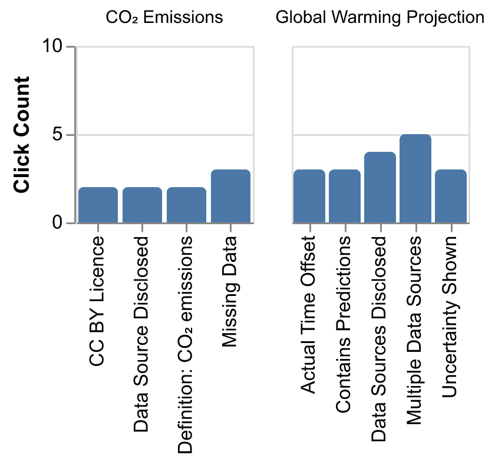
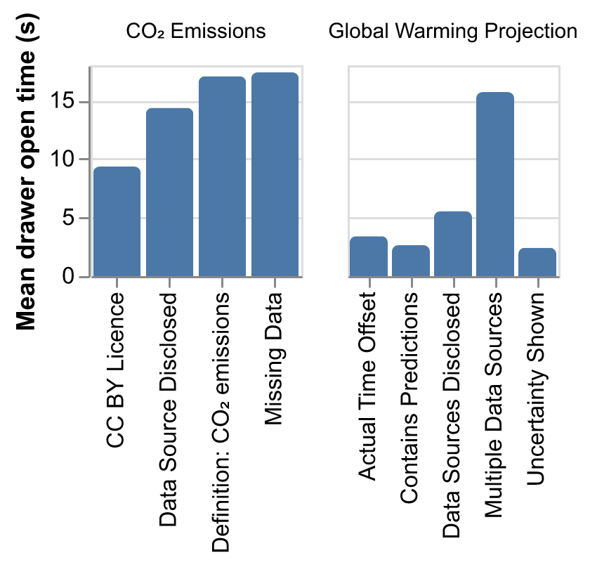

# Mind the Badge - Study Data Report
Generated at: `Mon, 01 Dec 2025 15:24 CET`

**Demographics**

| Category | Top values |
|---|---|
| Gender | Man (3), Woman (2) |
| Age | 25-34 years (2), 65+ years (1), 55-64 years (1) |
| Education | Bachelor's degree (2), Master's degree (2), Doctorate (e.g., PhD, EdD) (1) |
| Field | other (1), Social Sciences (Psychology, Sociology, etc.) (1), Arts / Design (1) |
| Reads charts | Occasionally (few times per month) (3), Rarely (few times per year) (1), Frequently (daily or almost daily) (1) |
| Creates charts | Occasionally (few times per month) (3), Rarely (few times per year) (1), Never (1) |
| Color vision | No (5) |

<strong>Show full demographics table</strong>

| Participant | Gender | Age | Education | Field | Reads charts | Creates charts | Color vision |
|---|---|---|---|---|---|---|---|
| alpha | Woman | 35-44 years | Doctorate (e.g., PhD, EdD) | Humanities | Occasionally (few times per month) | Occasionally (few times per month) | No |
| bravo | Man | 25-34 years | Master's degree | Computer Science / Information Technology | Frequently (daily or almost daily) | Occasionally (few times per month) | No |
| charlie | Man | 55-64 years | Master's degree | Arts / Design | Occasionally (few times per month) | Occasionally (few times per month) | No |
| delta | Woman | 65+ years | Bachelor's degree | Social Sciences (Psychology, Sociology, etc.) | Rarely (few times per year) | Never | No |
| echo | Man | 25-34 years | Bachelor's degree | other | Occasionally (few times per month) | Rarely (few times per year) | No |

# Main tasks
Task description: Imagine you're presenting this visualization to your boss. Write down the text you would use for your speech.

### Stimuli 1: CO₂ Emissions

| Footnotes condition | Badges condition |
| :-----------------: | :--------------: |
|  |  |

<strong>Participants Responses: CO₂ Emissions 🟦 Footnotes</strong> — 2 notes</strong>

🟦 **delta** (87 words): Starting around 1850, CO2 emissions began increasing, especially in Asia, North America and Europe. Africa, South America and Oceania has not seen a great increase over time. However, Asia has seen a significant increase in annual CO2 emissions since 1960 and is still on an upward trajectory. Asia emits at least twice as much emissions as any other continent. North America and Europe saw a steady increase in emissions until 1990 and then saw a leveling off and eventually a decrease in emissions starting in approximately 2005.

🟦 **charlie** (37 words): You can see from this visualization that most governments have changed their behavior in the 2000’s except for that of Asia which has abandoned any semblance of self control on emissions control in the last 20 years.

<strong>Participants Responses: CO₂ Emissions 🟩 Badges</strong> — 3 notes

🟩 **echo** (97 words): This is a graph of Annual CO2 emissions, with the X axis displaying the years from 1750 to 2023, and the Y axis showing billion tonnes of emissions. Africa, South America and Oceania all are around a similar output, ranging from 0-3 billion tonnes at the bottom of the graph. Europe and North America are grouped together with a similar trajectory, ranging around 5-7 billion tonnes, with a decrease in value over the last 3 years. Asia is a massively outlier, leading the output with over 20 billion tonnes, having shot up massively since the late 1990's

🟩 **bravo** (64 words): This chart shows annual CO2 emissions by continent through time up to 2023. While Europe and North America have peaked around 2000, Asia is still increasing its emissions rapidly. With about 23 billion tonnes of CO2 in 2023, Asia's emissions have grown to over 4 x that of Europe. Meanwhile, Africa, South America, and Oceania stay around or below 2 billion tonnes per year.

🟩 **alpha** (197 words): This line chart shows annual carbon dioxide emissions data from 1750 to 2023. The x-axis shows years in 50-year steps until 2000; the final step is 23 years. The y-axis shows volume of carbon dioxide in 5-billion steps from 0 to 25 billion tonnes. Asia (the red line) has the largest increase in CO₂ emissions, rising quickly after 1950 to a peak of around 22.5 billion in 2023. North America (brown) shows an increase from 1850 with a peak in approx. 2010 of approx. 7 billion and a decrease to approx. 6 billion by 2023. Europe (green) shows an increase from 1850 with a peak in the late 1900s of approx. 7.5 billion and a decrease to approx. 5 billion by 2023. Africa (purple), South America (dark red) and Oceania (dark blue) all show modest growth after 1950 rising to approx. 1-2 billion each. The chart offers extra information about the source of the data (Global Carbon Budget (2024) – with major processing by "Our World in Data"), the definition of CO₂ emissions, the license under which others can use this chart (CC BY (Creative Commons Attribution) License), and areas of missing data (Land-Use Emissions Not Included).

### Stimuli 2: Global Warming Projection

| Footnotes condition | Badges condition |
| :-----------------: | :--------------: |
|  |  |

<strong>Participants Responses: Global Warming Projection 🟦 Footnotes</strong> — 2 notes

🟦 **delta** (65 words): In the IPCC scenarios, we see a steady lowering of temperatures between 4.7C and 1.4C. With our current policies, temperatures will remain steady for each projection at around 2.6C (UNEP, CAT, and IEA). With 2030 commitments, there is a slight decrease in temperatures (down.2 to.3 degrees). With a net-zero promise and 2030 commitments, we will see a.8 -.9 decrease in temperatures across all prediction indicators.

🟦 **charlie** (48 words): Current policies vs actions taken of all world organizations, who the status of human nature when facing existential crisis. What is said or proposed seems to show that when it comes to actions taken the reality is much lower than what is proposed or said by national governments.

<strong>Participants Responses: Global Warming Projection 🟩 Badges</strong> — 3 notes

🟩 **echo** (96 words): This is a graph Comparing the latest 2100 warming projections for different scenarios, with the Y axis displaying degrees C, and the X axis displaying a range of IPCC scenarios, current policies, 2030 commitments and net-zero promises + 2030 commitments side by side. IPCC scenarios has the highest and lowest values, ranging from 4.7C to 1.4C, and is the highest average overall. This is followed by current policies, then 2030 commitments with the lowest average values being net-zero promises + 2030 commitments. It is apparent there is a downwards trend in values from left to right.

🟩 **bravo** (73 words): The chart shows multiple global warming scenarios as a projection of the average warming in degrees celsius by 2100. The leftmost group (in grey) shows the different reference scenarios simulated by the IPCC. In the other groups (coloured bars), projections from different sources are shown in each group. These projections align closely with each other, predicting c. 2.6C warming under current policies, 2.4C assuming execution of 2030 commitments, and 1.8C including net-zero promises.

🟩 **alpha** (188 words): This column chart shows how much the global temperature is expected to rise in 2100 according to four different predicted scenarios. The x-axis shows groups that have provided estimates of likely warming outcomes: United Nations Environment Programme (UNEP), Climate Action Tracker (CAT), the International Energy Agency (IEA) and Climate Resource (CR). The x-axis is split into four sections, Shared Socioeconomic Pathways (SSPs) that integrate different sets of population, economic growth, and other socioeconomic assumptions into future emissions scenarios, current policies, 2030 commitments, and net-zero promises and 2030 commitments. The y-axis shows degrees in Celsius. The different SSPs predict a temperature rise between 1.4 and 4.7 degrees Celsius. With the current policies, UNEP, CAT and IEA predict a temperature rise between 2.6 and 2.7 degrees Celsius. With the 2030 commitments, UNEP, CAT and CR predict a temperature rise of around 2.6 degrees Celsius. With the net-zero promises and 2030 commitments, UNEP, CAT, IEA and CR predict a temperature rise of around 1.8 degrees Celsius. The chart offers extra information about the data sources used, uncertainty in the data, the time offset, and the fact that these figures are predictions.

# Post-questionaire

**Likert scale questions per dimension**
- **Saliency** Footnotes/Badges were easy to spot. (1 = Strongly Disagree, 5 = Strongly Agree)
- **Clutter** Footnotes/Badges cluttered or distracted from the visualization. (1 = Strongly Disagree, 5 = Strongly Agree)
- **Interpretability** Footnotes/Badges were clear and easy to interpret. (1 = Strongly Disagree, 5 = Strongly Agree)
- **Usefulness** Information in the Footnotes/Badges was useful for understanding the visualization. (1 = Strongly Disagree, 5 = Strongly Agree)
- **Trust** Footnotes/Badges increased my trust in the information and methodology. (1 = Strongly Disagree, 5 = Strongly Agree)
- **Standardization** Footnotes/Badges like these should be widely used alongside visualizations. (1 = Strongly Disagree, 5 = Strongly Agree)

**Distributions and medians**

**Mean bar charts**

### Open-ended answers

**Noticing and interactivity** — 5 responses

| Group | Yes | No | Sometimes | Not sure |
|---|---|---|---|---|
| Footnotes | 1 | 0 | 1 | 0 |
| Badges | 3 | 0 | 0 | 0 |

<strong>Noticing and interactivity (Badges group only)</strong> — 2 responses

**🟩 Badges question:** Additional comments about noticing or interactivity

- **echo** (24 words): I did not try to hover over any icons or visualisation badges at all, it did not even cross my mind to do so.

- **bravo** (14 words): They were well-designed, not getting in the way, but there when I was interested.

<strong>How annotations influenced reading (Badges group only)</strong> — 2 responses

**🟩 Badges question:** If you noticed the visualization badges, describe your experience using them alongside the visualization. Did they influence how you read and interpreted the visualization? If so, how?

- **bravo** (30 words): They reminded me that some data was only based on predictions and there was uncertainty between data sources. I also found information about copyright, but I wasn't interested in that.

- **alpha** (82 words): The visualization badges being interactive were very helpful in providing context and extra information to interprest the chart, especially in judging its accuracy and relevance. By providing this extra information I could check the data myself (although I didn't in these exercises). I assumed they were important to understand the data being visualised but they did not change my interpretation of the visualisations - I imagine they would if climate change was an area I knew a lot about / worked in.

<strong>Ease of understanding annotations</strong> — 5 responses

**🟦 Footnotes question:** How easy was it to understand the footnotes?

- **delta** (26 words): It put the information on the charts into prospective. It wasn't the easiest to understand but it did help to understand what I was looking at.

- **charlie** (26 words): Too many acronyms or letter combinations. I almost felt like I needed to go out and get a definition so I could understand what they meant.

**🟩 Badges question:** How easy was it to understand each visualization badge—from the label alone and from the detailed description on hover/click?

- **echo** (26 words): I glanced at them but did not try to interpret them as I was not aware of what they were, I focused on the graphs specifically.

- **bravo** (38 words): Some of them were easy to understand by the face of them (e.g. multiple data sources), others (e.g. copyright) weren't but gave a good sense of what information was to be found when you would click on them.

- **alpha** (2 words): Very easy.

<strong>Use of annotations in the main task</strong> — 5 responses

**🟦 Footnotes question:** Did you consider information in the footnotes for Your Speech? Please explain.

- **delta** (11 words): Yes, but I used the graphs for most of my input.

- **charlie** (15 words): I didnt really consider that the answers would be there. This seemed hard to decipher.

**🟩 Badges question:** Did you consider information from visualization badges in Your Speech? Please explain.

- **echo** (14 words): No, I did not realise what they were nor try to interact with them

- **bravo** (5 words): Yes, I emphasised the uncertainty.

- **alpha** (20 words): Yes. I assumed the information from the visualisation badges was important to determine the accuracy and reliability of the data.

<strong>Most and least useful annotations (Badges group only)</strong> — 2 responses

**🟩 Badges question:** Which visualization badges were most and/or least useful? Why?

- **bravo** (14 words): Most: highlighting uncertainty and multiple sources
Least: copyright and the ones I forgot already

- **alpha** (13 words): The ones explaining the labels in the charts (i.e. UNEP, CAT, IEA, etc)..

<strong>Overall helpfulness of annotations</strong> — 5 responses

**🟦 Footnotes question:** Overall, did the footnotes help you understand and interpret the visualization? Please explain.

- **delta** (24 words): Yes. It helped me understand what I was viewing. Without the footnotes on the first graph, I would have been wondering what everything meant.

- **charlie** (12 words): They helped, but I spent more time on looking at the visualization.

**🟩 Badges question:** Overall, did the visualization badges help you understand and interpret the visualization? Please explain.

- **echo** (11 words): No, I did not interact with the visualisation badges at all

- **bravo** (11 words): Yes. They made me aware of the limitations of the chart.

- **alpha** (1 words): Yes.

<strong>Additional comments (Badges group only)</strong> — 2 responses

- **echo** (17 words): I might have used the badges if I was more aware of them and their intended purpose

- **bravo** (78 words): I think some of these badges would highlight potential issues in a visualisation that you would not have when you are aware of these issues. So, on one hand I think using them as a checklist while you make your visualisation even helps making a better chart, but on the other hand this will not fix most problematic visualisations on the internet because ignorant people won't use these badges either. In general, I think they are mostly helpful.

### Badge interactions – hover metrics

| Hover counts | Total hover time | Duration stats |
| :-----------------------------------------------: | :--------------------------------------------------------: | :-----------------------------------------------------------: |
|  |  |  |

### Badge interactions – clicks and drawer metrics 

_Note: No data, because nobody clicked on any badge_

| Click counts | Total open time | Mean open duration |
| :----------: | :-------------: | :----------------: |
|  |  |  |

### Participant ID mapping and time per component

<strong>Show participant ID mapping and time per component (minutes)</strong>

_Times per component are shown in minutes (rounded to 1 decimal)._

| Readable ID | Participant GUID | Group | introduction (min) | consent (min) | pre-example (min) | example (min) | co2-emissions (min) | global-warming-projection (min) | pre-questionnaire (min) | badge-questionaire-1 (min) | badge-questionaire-2 (min) | demographics-custom (min) | footnote-questionaire-1 (min) | footnote-questionaire-2 (min) | total (min) |
|---|---|---|---|---|---|---|---|---|---|---|---|---|---|---|---|
| echo | `60cf0d251a90eb823bc9b740` | badge | 0.1 | 0.0 | 0.1 | 0.5 | 4.4 | 3.7 | 0.1 | 2.5 | 0.7 | 0.4 | 0.0 | 0.0 | 12.6 |
| delta | `6369700320bc7dd22e733009` | footnote | 0.4 | 0.2 | 0.5 | 1.9 | 4.9 | 5.6 | 0.1 | 0.0 | 0.0 | 0.5 | 1.6 | 0.4 | 16.0 |
| charlie | `7b88dea0-0445-4362-b670-01be60f5195b` | footnote | 0.2 | 2.9 | 0.1 | 2.4 | 1.8 | 6.4 | 0.1 | 0.0 | 0.0 | 0.7 | 3.2 | 1.3 | 19.0 |
| bravo | `782e2f94-ade5-4279-94aa-9dcdb26abbcd` | badge | 0.6 | 1.5 | 0.2 | 1.4 | 4.7 | 6.9 | 0.1 | 4.7 | 3.9 | 0.5 | 0.0 | 0.0 | 24.4 |
| alpha | `5101b146-ce6f-4f61-8818-118229a2308b` | badge | 0.1 | 0.4 | 0.7 | 1.5 | 12.8 | 12.2 | 0.1 | 4.6 | 0.5 | 0.6 | 0.0 | 0.0 | 33.4 |

