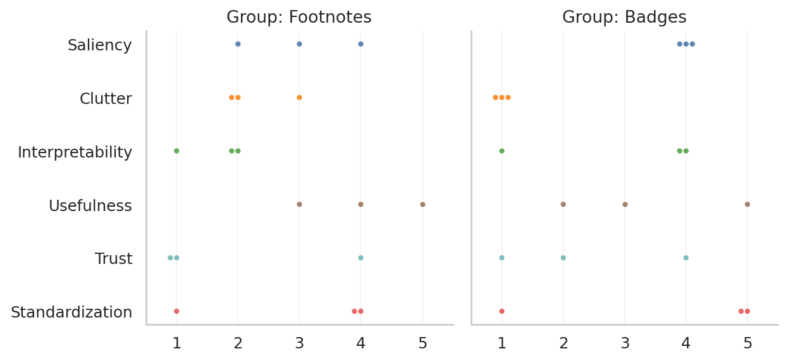

Generated at: `Sun, 16 Nov 2025 13:16 CET`

### Likert questions

- **Saliency** Footnotes/Badges were easy to spot.
- **Clutter** Footnotes/Badges cluttered or distracted from the visualization.
- **Interpretability** Footnotes/Badges were clear and easy to interpret.
- **Usefulness** Information in the Footnotes/Badges was useful for understanding the visualization.
- **Trust** Footnotes/Badges increased my trust in the information and methodology.
- **Standardization** Footnotes/Badges like these should be widely used alongside visualizations.

### Likert beehive (compact)

Scale: 1 = Strongly Disagree, 5 = Strongly Agree. Facets show Group: Footnotes and Group: Badges. Colors indicate dimensions.

### Likert – mean bar chart

Grouped vertical bars: Footnotes (grey) and Badges (blue) per dimension. Values shown above bars.
