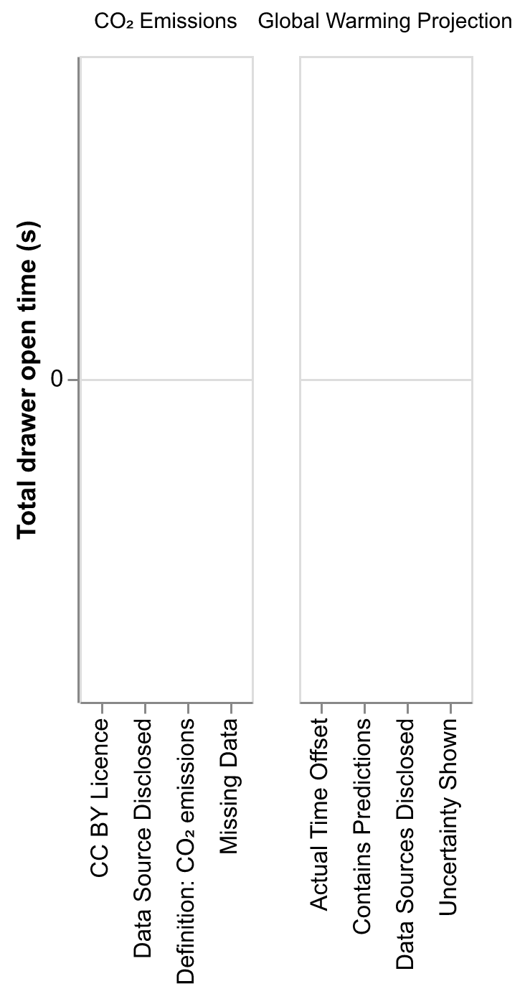

Generated at: `Wed, 19 Nov 2025 15:24 CET`

### Demographics

| Category | Top values |
|---|---|
| Gender | Woman (3), Man (2), Non-binary (1) |
| Age | 25-34 years (5), 35-44 years (1) |
| Education | Master's degree (3), Doctorate (e.g., PhD, EdD) (3) |
| Field | Computer Science / Information Technology (5), Arts / Design (1) |
| Reads charts | Regularly (few times per week) (3), Frequently (daily or almost daily) (2), Occasionally (few times per month) (1) |
| Creates charts | Occasionally (few times per month) (3), Regularly (few times per week) (1), Never (1) |
| Color vision | No (6) |

<strong>Show full demographics table</strong>

| Participant | Gender | Age | Education | Field | Reads charts | Creates charts | Color vision |
|---|---|---|---|---|---|---|---|
| alpha | Woman | 25-34 years | Doctorate (e.g., PhD, EdD) | Computer Science / Information Technology | Regularly (few times per week) | Occasionally (few times per month) | No |
| bravo | Non-binary | 35-44 years | Doctorate (e.g., PhD, EdD) | Arts / Design | Frequently (daily or almost daily) | Rarely (few times per year) | No |
| charlie | Man | 25-34 years | Master's degree | Computer Science / Information Technology | Occasionally (few times per month) | Never | No |
| delta | Woman | 25-34 years | Doctorate (e.g., PhD, EdD) | Computer Science / Information Technology | Frequently (daily or almost daily) | Occasionally (few times per month) | No |
| echo | Woman | 25-34 years | Master's degree | Computer Science / Information Technology | Regularly (few times per week) | Occasionally (few times per month) | No |
| foxtrot | Man | 25-34 years | Master's degree | Computer Science / Information Technology | Regularly (few times per week) | Regularly (few times per week) | No |

### Badge interactions – hover metrics

| Hover counts | Total hover time | Duration stats |
| :-----------------------------------------------: | :--------------------------------------------------------: | :-----------------------------------------------------------: |
|  |  |  |
| Total hover counts per stimulus (shared y-axis labelled “Hover Count”). | Total hover time per badge (bars), facetted by stimulus. | Mean hover time per badge (bars), facetted by stimulus. |

### Badge interactions – clicks and drawer metrics

| Click counts | Total open time | Mean open duration |
| :----------: | :-------------: | :----------------: |
|  |  |  |
| Total click counts per badge, facetted by stimulus. | Total time drawers were open per badge (s). | Average open time per open event (s) per badge. |

### Stimulus notes

- Total entries: 12
- Median words: 112
- Mean words: 100.6
- By group: Badges: 6; Footnotes: 6

<strong>CO₂ Emissions</strong> — 6 notes

- <em>Footnotes</em> (echo, 126 words): The historical annual record of global CO2 emissions starts from 1750 sourced from Global Carbon Budget (2024). Before 1850 there're barely any CO2 emissions on the billion ton scale. Since 1850, emissions started to rise with Europe and North America lead the emission, which is in accordance with knowledge in industrial revolutions, trade, and wars. Europe and North America had been the biggest emission regions since record to around 1990. After that they are on the decline and there's a sharp increase for Asia in emissions from 1950. The turning point of emission in 1990s was around 7-8 billion tons annually for Europe, North America and Asia. However the sharp increase in Asia continues and is now reaching over 22 billion ton a year in 2023.

- <em>Footnotes</em> (foxtrot, 141 words): This chart display the evolution of annual CO2 emissions (in tons) between 1750 and 2023 for continents (with America being splits into two parts) We can note that all continents stayed at 0t until the first part of 1830 where Europe (in green) started to slowly increasing their emission. They were followed in late 19th century by North America (NA). The 20th century established a strong explosion of annual CO2 emission in 1945 where NA, Europe and Asia went from less 5 billions t, to approximatively 8 billions t. The start of the 21th century marked a stabilization of NA and Europe emission around 5 billions t, while Asia keep exploding until reaching more than 20 billions t in 2023. In the meantime, Africa, South America and Oceania, started also to increase their emission to reach appromatively 2.5 billions in 2023.

- <em>Badges</em> (delta, 132 words): This line chart shows the evolution of annual CO₂ emissions by continent over time. The x-axis represents the years from 1750 to 2023, with 50-year intervals, while the y-axis shows annual CO₂ emissions ranging from 0 to 25 billion tons, in increments of 5 billion tons. The chart reveals that CO₂ emissions remained close to zero until around 1850. After that point, emissions increased rapidly across north continents. Europe and North America were the highest emitters until the late 20th century, when they were surpassed by Asia. Asia’s emissions grew exponentially from 1900, reaching in 2023 a level nearly twice the combined total of all other continents. For the remaining continents—Africa, South America, and Oceania—the increase began later, around 1950. By 2023, their emissions remained below 2 billion tons of CO₂ each.

- <em>Footnotes</em> (charlie, 122 words): On this line chart describing the CO2 emissions per continent, qe can see that the western ones start the rise of theirs in the 1850s and start to strikingly increase from the 1950s. Although it reaches a peak of about 7 billion tons a year for Europe between the 1970s and 1980s, the continent starts to decline in its annual emissions continuously down to 5 billion tons in 2023. In the meantime, North America steadily augments its emissions up to the 2010s (~7 billion tons) before starting its decline. On the other hand, Asia doesn't start to emit a noticeable amount of CO2 until the late 1950s where it skyrockets its emissions to 23 billion tons of CO2 in 60 years only.

- <em>Badges</em> (bravo, 46 words): This line chart shows the annual C02 emissions for all the continent on Earth. Asia is skyrocketing since 1950. North America and Europe start to decrease respectively in 2010 and 1980. Africa, South America and Oceania are really low. This graph does not include land change.

- <em>Badges</em> (alpha, 46 words): The chart presents the CO2 emissions of Asia, North America...While the increase in the absolute value of CO2 emissions from Asia is shocking and alarming, we need to look into the CO2 emissions per person to understand which region should pay more attention to the issue.

<strong>Global Warming Projection</strong> — 6 notes

- <em>Footnotes</em> (echo, 79 words): IPCC publishes projections of global warming following five different pathways, the highest being 4.7 degrees in "SSP5-8.5" and the lowest being 1.4 degrees in "SSP1-1.9". Current policies and 2030 commitments are around the "SSP2-2.45" pathway which is the middle one, where current policy is slightly behind the 2030 commitments by around 0.2 degrees. The projections from UNEP, CAT, and IEA are not very different. Net-zero promises + 2030 commitments are the most promising one in terms of warming projections.

- <em>Footnotes</em> (foxtrot, 125 words): These four series of bar chart display the warming projection for differents scenarios in 2100. First, the IPCC scenarios demonstrate what would happens regarding differents trajectories (SSP) with the SSP1-1.9 leading to only 1.4°C increase compared to the 4.7°C of the SSP5-8.5 scenario. Then the 3 others series of charts explore other scenarios (respectively, UNEP, CAT et IEA) according to the application of current policies or maintaining commitements. We can see that all scenarios leads to similar results inside each policies applications. With current policies, warming will increase from 2.6 or 2.7°C degrees. With 2030 commitments it should be only 2.4°C (CR is not taken in account). With Net-zero promises and 2030 commitments, we should limit the increase at 1.8°C (CR is also not included)

- <em>Badges</em> (delta, 135 words): This bar chart compares global warming projections for the year 2100 under four different scenarios. The projections were made in 2021. The graph is divided into four sections, each corresponding to one scenario. In every section, the x-axis represents the various projections, while the y-axis indicates the expected increase in global temperature (in degrees Celsius). Each bar shows the estimated temperature rise for a specific projection within a scenario, along with its associated confidence interval. In the first scenario, the projections are produced by different organizations than those used for the other scenarios. It is clear that the IPCC scenarios are the most pessimistic, projecting up to a 4.7°C increase by 2100. In contrast, the “Net-zero promises + 2030 commitments” scenario is the most optimistic, with all projections agreeing on a 1.8°C increase by 2100.

- <em>Footnotes</em> (charlie, 95 words): This bar chart shows the projected global temperature rise by 2100 according to different scenarios described by the IPCC, the current policies of groups of countries, their 2030 commitments and those commitments associated with Net-zero promises. The IPCC scenarios range from the most pessimistic (4.7°C) to the most optimistic (1.4°C) while the current policies allow for the median scenario (2.7°C), the 2030 commitments only show a difference of 0.3°C to the current policies. Meanwhile, the net-zero policies implies a projection of almost a full degree Celsius difference difference with the projection of the current policies.

- <em>Badges</em> (bravo, 102 words): This graph shows several bar charts. The first one present different IPCC predictions regarding the expected temperature on Earth according to 5 different scenarios. The second one shows different projection considering current policies, according to different agencies. It's almost the same value: 2.6°C, which correspond to the middle scenario of IPCC. The third one shows the expected temperature rise considering the 2030 commitments. It's around 24°C. One value is missing for CR. Same for the fourth bar chart, but here considering the net-zero is achieved, leading to an increase of 1.8°C in average. A badge is wrong: the uncertainty is not showed.

- <em>Badges</em> (alpha, 58 words): I find I lack the expertise to write my speech as I don't understand the content on the x-axis. I noticed the four labels on the bottom right. I suppose I will explain the data sources and highlight that there is data about uncertainty, and some data is predictions. However, I don't understand what "Actual Time Offset" means.

### Likert questions

- **Saliency** Footnotes/Badges were easy to spot.
- **Clutter** Footnotes/Badges cluttered or distracted from the visualization.
- **Interpretability** Footnotes/Badges were clear and easy to interpret.
- **Usefulness** Information in the Footnotes/Badges was useful for understanding the visualization.
- **Trust** Footnotes/Badges increased my trust in the information and methodology.
- **Standardization** Footnotes/Badges like these should be widely used alongside visualizations.

### Likert beehive (compact)

Scale: 1 = Strongly Disagree, 5 = Strongly Agree. Facets show Group: Footnotes and Group: Badges. Colors indicate dimensions.

### Likert – distributions and medians

Per-dimension Likert score distributions (circle size = number of ratings), faceted by group (Footnotes vs Badges). Scale: 1 = Strongly Disagree, 5 = Strongly Agree.

### Open-ended answers

<strong>Notice comments</strong> — 6 responses

- <em>Footnotes</em> (echo): nan

- <em>Footnotes</em> (foxtrot): nan

- <em>Badges</em> (delta): I spontaneously hovered over the warning badges much more often than the informative ones.
My attention was more focused on the data.

- <em>Footnotes</em> (charlie): nan

- <em>Badges</em> (bravo): nan

- <em>Badges</em> (alpha): I only noticed the interactivity until the last chart.

<strong>Experience with badges</strong> — 6 responses

- <em>Footnotes</em> (echo): nan

- <em>Footnotes</em> (foxtrot): nan

- <em>Badges</em> (delta): For one of the charts, I noticed a badge indicating that some of the data was somewhat outdated. For the elements displayed, it made sense to mention this in the description.

- <em>Footnotes</em> (charlie): nan

- <em>Badges</em> (bravo): When it was positive, I did not mentioned it, but when it was negative, I said so in the text box.

- <em>Badges</em> (alpha): They point out some details I missed when I only read the charts.

<strong>Ease of understanding</strong> — 6 responses

- <em>Footnotes</em> (echo): Not easy, I forgot what the footnotes were about for the emission chart because I did not take a close look. For the first one about warming projections, because I did not understand the chart axis so I read the footnotes. But still it is difficult to understand because the font is really small and a bit off-putting to read small, technically written text.

- <em>Footnotes</em> (foxtrot): The first one was quite clear.
For the second example, a lot of context information should have been present ahead of the chart instead of just on footnotes.

- <em>Badges</em> (delta): I didn't read everything but the one I read was very easy to understand and I was happy that the description was short.

- <em>Footnotes</em> (charlie): Not easy enough for me to continue reading them after I realized I did not have some of the vocabulary nor understood most of the abbreviations which weren't explained (and mostly had to guess what they meant along the way, especially for the IPCC scenario stuff).

- <em>Badges</em> (bravo): Easy

- <em>Badges</em> (alpha): With a detailed description, it is relatively easy. With only badges, I understand most of them, but a few.

<strong>Considered in notes</strong> — 6 responses

- <em>Footnotes</em> (echo): I considered the footnotes in the first chart because it helped me at least a little bit in understanding the terminology presented in the x-axis. I'm not confident about what I put in the speech text though, for I don't think I understand clear enough about those terms. The second chart I did not use information in the footnotes, I took a glance it was about the data collection and calculations, I was describing the trends in the line charts so I did not use it.

- <em>Footnotes</em> (foxtrot): Yes, it helped me understood what I was looking on and so, what to write, especially on the second chart.

- <em>Badges</em> (delta): Only in the case mentioned above — the one where the data might be outdated.

- <em>Footnotes</em> (charlie): not at all. For the bar chart, since I could not make out what everything meant, I would not use an information I can't fully understand.

- <em>Badges</em> (bravo): Yes

- <em>Badges</em> (alpha): After I noticed these badges, I would warn people about potential misunderstandings of the data and also double-verify my findings in my speech.

<strong>Most/least useful</strong> — 6 responses

- <em>Footnotes</em> (echo): nan

- <em>Footnotes</em> (foxtrot): nan

- <em>Badges</em> (delta): As mentioned above, I didn't really pay attention to the blue badges. I mainly noticed the warnings.

- <em>Footnotes</em> (charlie): nan

- <em>Badges</em> (bravo): I don't remember

- <em>Badges</em> (alpha): So far, I consider that every badge conveys meaningful warnings or extra information. Those red (yellow) and blue badges are relatively more useful than green badges for me to examine my interpretations of the chart.

<strong>Overall help</strong> — 6 responses

- <em>Footnotes</em> (echo): If the visualisation looks confusing to me, requires a lot of contextual information like the first one, then I make more effort to process the information in the footnotes. If not really complicated then I took a glance to decide if I want to read more about it. I think footnote is rarely noticeable and really need some effort, so I try to avoid unless I really need more information. But if the footnote is written in a very technical style I get upset, they have more space to put complete sentences (!!) should be in plain english.

- <em>Footnotes</em> (foxtrot): Yes, as I stated previously it helped me understood what I was looking on

- <em>Badges</em> (delta): The badges helped to contextualize the visualization but I wouldn't say that it helped understanding it.
I was happy to have access to this additionnal data in such a way that didn't overwhelmed the chart.

- <em>Footnotes</em> (charlie): The only way it did was for the bar chart to give me some clues as what could be the meaning of the acronyms.

- <em>Badges</em> (bravo): Not really, it just triggers some critical thinking

- <em>Badges</em> (alpha): They point out some details I missed when I only read the charts.

<strong>Final comments</strong> — 6 responses

- <em>Footnotes</em> (echo): generally speaking I believe more contextual information is better than nothing at all that's why I gave a 4 for the last question.

- <em>Footnotes</em> (foxtrot): nan

- <em>Badges</em> (delta): nan

- <em>Footnotes</em> (charlie): Footnotes are only useful to their destined audience. If the goal is to help people from any background understand it, it should hold all the disambiguation needed to even comprehend the footnote itself. Otherwise it just excludes the profanes.

- <em>Badges</em> (bravo): nan

- <em>Badges</em> (alpha): nan

### Likert – mean bar chart

Grouped vertical bars: Footnotes (grey) and Badges (blue) per dimension. Values shown above bars.

### Participant ID mapping

<strong>Show participant ID mapping</strong>

| Readable ID | Participant GUID | Group |
|---|---|---|
| echo | `9a73ce92-5365-411d-a81d-1db38ff72f4e` | footnote |
| foxtrot | `2b69160b-3a1e-4ad9-9039-f3758f20b569` | footnote |
| delta | `37b66c79-da74-498e-9567-c79c5d7efd41` | badge |
| charlie | `4798e3dc-4588-41b2-8e23-9f43d695c79e` | footnote |
| bravo | `0b6ad5e0-be61-411e-980c-c773e0482c66` | badge |
| alpha | `6a223d18-f389-4312-a78f-38ca9bbbd583` | badge |

